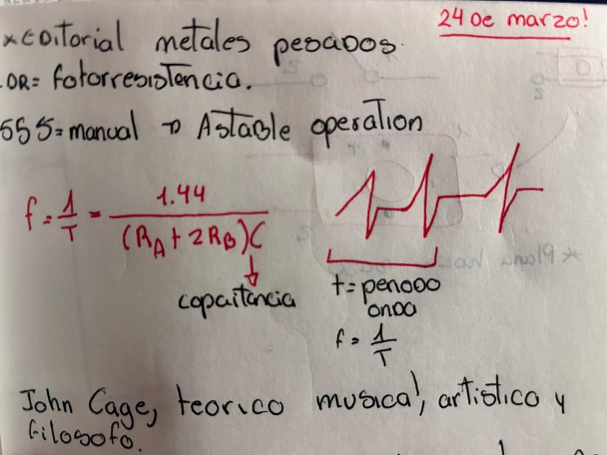
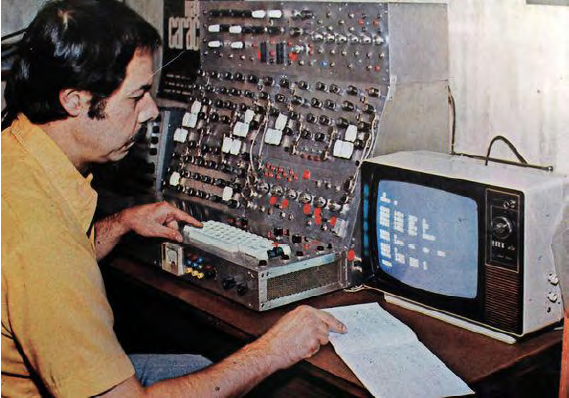

# sesion-03a

## **Apuntes**

*Editorial metales pesados

ldr=fotorresistencia 

555=manual-astable operation

f=1/t=1.44/(Ra+2Rb)C

C=capacitancia 

*Jhon Cage, teorico musical, artistico y filosofo 

David Tudor, pianista, que tomo el rumbo de la musica electronica

*el tiempo el que se repite un ciclo es una "onda"
                       /
                ____O     O____
                  interruptor
          switch             temporales        
          ampolleta          timbre/push

]---+| (---              filto rc
           | 🔊           

## **ENCARGO**

*Integrantes:Isidora Alvarez-Dayana Pañitrur-Camila Ramirez

*apuntes*

*cada switch emitia un sonido diferente, sus bibraciones igual iban variando.*

nos costo entender la parte de los switch con los cables y las resistencias pero logramos resolverlo

## **Documental**

**Variaciones Espectrales**

El documental Variaciones Espectrales habla sobre José Vicente Asuar, un músico e ingeniero chileno que fue un pionero de la música electrónica en Chile. La verdad, lo que más me impresionó no fue toda su historia ni los premios que recibió, sino su invento, el computador “comdasuar” musical digital analógico que podía generar música usando cálculos y programación. Lo impresionante es que esto fue mucho antes de que los sintetizadores fueran comunes, así que básicamente estaba creando música con una máquina totalmente adelantada a su época. Me quedé impresionada al ver cómo podía componer sola y cómo Asuar mezclaba tecnología y creatividad de una forma que todavía hoy se ve innovadora.

El documental también cuenta un poco sobre su vida, cómo estudió en Alemania, volvió a Chile y fundó el primer laboratorio de música electrónica en la Pontificia Universidad Católica. Se habla de su influencia en la música y la danza, de cómo su figura quedó un poco olvidada y de cómo la política y el contexto social afectaron la difusión de su trabajo. También mencionan los premios que recibió el documental, como In Edit 2013 y otros festivales de cine, pero para mí lo más interesante sigue siendo el invento en sí.

Al final, me quedó la sensación de que Asuar era un tipo muy adelantado a su tiempo. Lo que hizo con el comdasuar demuestra que la innovación y la creatividad pueden aparecer en lugares inesperados, y que la música electrónica en Chile tuvo momentos súper importantes que a veces quedan fuera de los libros de historia. Para mí, la máquina es lo que hace que el documental valga la pena y lo que más recuerdo de todo.

        
