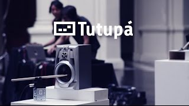

# sesion-03a

## apuntes clase

Tutupá máquina percusión 

Sokio 

ldr = fotorresistor

pot = potenciometro

Semana pasada hicimos un circuito a-estable

Frecuencia: repetición de un suceso en el tiempo

La frecuencia sube o baja gracias a el condensador dependiendo su tamaño y de resistencia dependiendo de su kilo

Siempre al hacer algún cambio en el circuito, sacar batería

Lo escrito en el parlante indica el ohm

Oscilador victoriano / macumbista el rebote del propio parlante se aprovecha para que las pinzas chocan y emiten electricidad y se repita el ciclo de 

John cage y su fascinacion por la musica y los hongos, 4'33

Cuando conecto un condensador en serie sirve como un suavizante, depende de él uf que tenga el condensador cuanto suaviza

Moog filter ladder

Hay interruptores de switch y temporales/push/momentaneo (switch es el de ampolleta y los temporales son el del timbre)

### videos de uso del parlante en el circuito

esquema

ejercicio con potenciometro

https://github.com/user-attachments/assets/4c38dc6d-85c7-41c3-9480-1d74eac255be

ejercicio con fotorresistor

https://github.com/user-attachments/assets/35481624-8dea-41d3-8201-f6a4b48427d7

## encargo 03a

aqui esta el encargo del toy organ que relizamos en conjunto anays y yo

al inicio no daba resultado, no sonaba nada ya que conectamos mal el cable que iba en el pie 7 de el chi, porque estaba puesto en el 6

al arreglar el error si apretabamos los botones de manera individual no sonaba nada, pero si lo apretabamos a la vez, suena

https://github.com/user-attachments/assets/601b00d3-f787-4bd0-a8f5-ab5f71dc7c2c

luego de esto agregamos un cable en la pata 3 del potenciometro a la pata 7 del chip, lo que dio como resultado que al apretar los botones al mismo tiempo sonaba pero al mover el potenciometro no habia cambio, aun no sonaban los botones por separado

en este punto ya no sabiamos que pasaba asi que revisando los resultados de nuestro compañeros nos dimos cuenta que teniamos algunos errores

el cable que teniamos conectado en el primero boton a la resistencia 2, lo cambiamos directamente al potenciometro, a la pata 3

y pusimos un cable que iba de la resistencia 2 a la pata 2 del chip y finalmente funciono :)  
aca va el encargo

https://github.com/user-attachments/assets/f88a67db-bac4-4f03-a379-18ac2e9e0926

### documental variaciones espectrales

el documental variaciones espectrales habla de la vida y obra de Jose Vicente Asuar, quien es pionero de la música electrónica en chile, su obra variaciones espectrales es considerada la primera obra de música electrónica en chile, obra estrenada en 1959. lo que mas me llama la atencion en este documental es ver las partituras de la obra que son lineas, figuras geometricas, puntos que cada uno hace un sonido distinto y que al variar su forma o trazado  suena la frecuencia mas rapdio o mas lento. tambien asuar su propio computador dedicado a solo la creacion musical llamado comdasuar, el cual quedo abandonado en una casa de campo de el. me gusta como termina el coumental con la frase que la musica fue su gran amor, pero talvez no fue lo suficiente, que debio amarla mas todavia, que refleja que a pesar de abandonar todo, sigue manteniendo ese amor por su creacion
