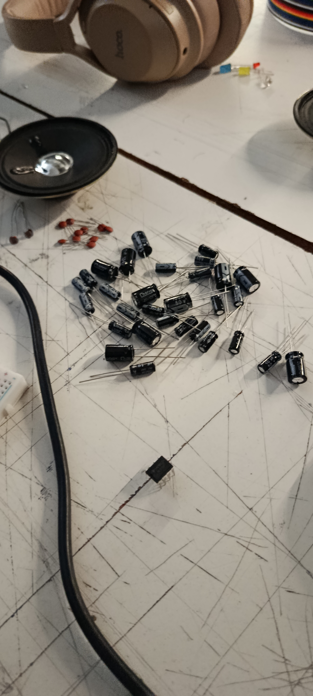
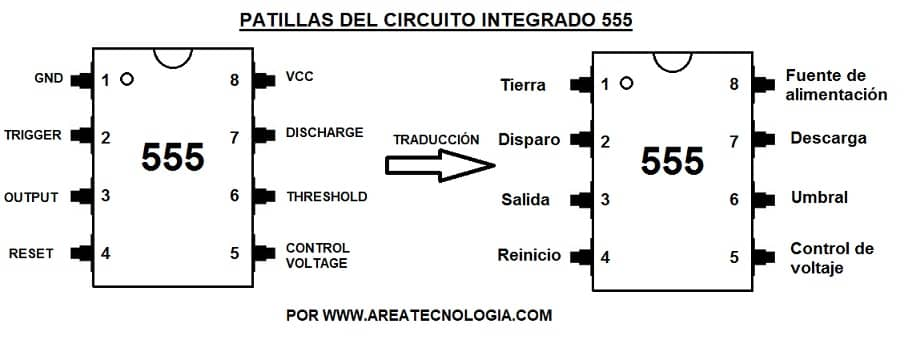
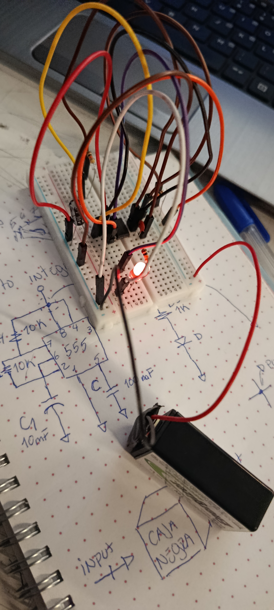
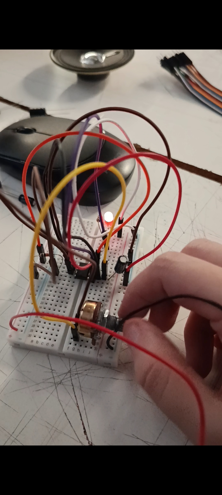
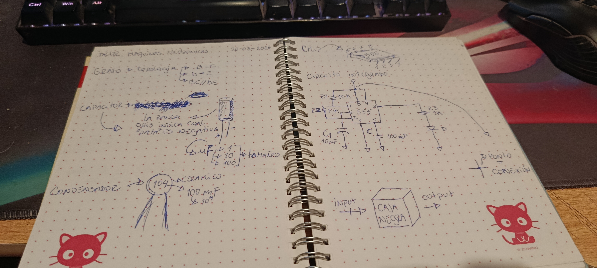

# sesion-02b

## Clase Martes 20 de marzo de 2026

### Apuntes de la clase

En esta clase nos entregaron nuevos componentes, en los que podemos encontrar condensadores y capacitores. En el caso del capacitor, sus patas son parecidas a las de los LED, en el sentido de que tiene una más larga y otra más corta; pero en el capacitor se nos indica el lado que es negativo, puesto que en su diseño tiene una banda gris que es el indicador del lado negativo. Por ende, el lado contrario es el positivo.
Los capacitores se miden en µF, de los cuales se nos entregaron capacitores de 1 µF, 10 µF y 100 µF. La función del capacitor es la de almacenar energía, es polarizado y es clave para definir tiempos en circuitos con 555.
Por otro lado, tenemos el condensador cerámico, o también llamado en clase como “lenteja”, el cual es pequeño y se mide en mF. Su función es temporizar o filtrar; este componente es no polarizado.

- **Materiales entregados en clase**

Durante la clase también aprendimos sobre el chip NE555, el cual sería como el cerebro de todo el circuito. Este chip 555 está compuesto por 8 patitas, en las que cada una cumple una función dentro del circuito; además, su disposición tiene un orden específico, el cual nos indica dónde va cada componente junto con los esquemas y/o planos técnicos. Normalmente, se usa para generar pulsos o temporizaciones.

- **imagen referencial del chip, y equivalencias de sus patas**

Con esta información hicimos primero un circuito integrado solo con LED en un principio, para posteriormente agregarle un potenciómetro, el cual sirve para ajustar la resistencia variable. Al agregarle el potenciómetro, regulamos qué tan rápido o qué tan lento parpadea el LED.

- **Primer circuito hecho en clases**

- **Aquí se le agrego el potenciometro**

- **Imagen bitacora escrita a mano**

