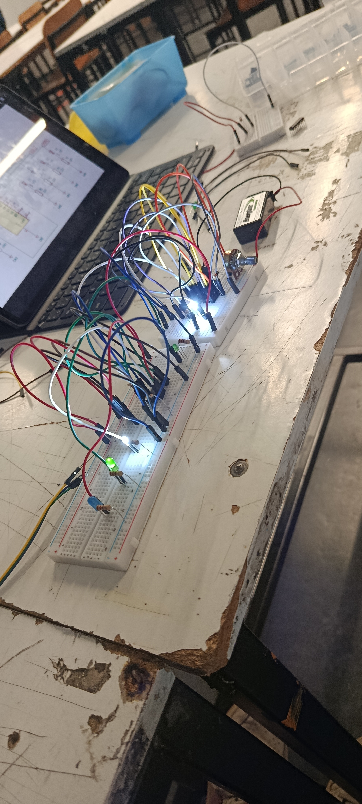

# sesion-05b
Clase 10 de abril

## Apuntes

La clase de hoy empezo hablando sobre UX, esto quiere decir con la experiencia al usuario en el producto vamos a decirlo de alguna manera. Para esto poder llevarlo a nuestro trabajo debemos considerar en que lo ideal seria en empezar por no pensar solamente en el que producto funcione, sino como se usará. Para esto debemos considerar lo siguiente:
 
  - Qué es lo que controlará el usuario
  - Qué tan intuitivo será el producto
  - El cómo se entendera la interacción con este

  ## Secuenciadores y CLock 

  
Durante la siguiente parte de la clase y en lo que nos dedicamos el resto de la clase, nos hablaron sobre los secuenciadores y lo que es un Clock. Básicamente un secuenciador o la función de este es ir activando las salidas una por una, de manera ordenada y esto permite poder lograr patrones, esto ya sea con luces o sonidos, o bien, las dos juntas. Un Clock como su palabra lo imita es un reloj y es una señal que marca el ritmo, este define la velocidad de todo, es decir, mientras más rápido, más rapido será la secuencia. Esto se puede utilizar para:
  
  - Prender LEDS en secuencia
  - Poder generar ritmos
  - Para activar distintos módulos

  ## Chip 4017

  
Explicado lo de la secuencia y el CLock pasamos a la siguiente parte de esta clase, en la que ocupamos un nuevo chip, el 4017, el cual es un contador de décadas. Este chip tiene 10 salidas y las va activando secuencialmente cada vez que recibe un pulso reloj, es decir, básicamente va contando y de esta manera va distribuyendo la señal.

  

Luego en la clase hicimos un ejercicio con este chip, en donde consistia lograr que las LEDS pudieran encenderse siguiendo un patrón, que nosotros pudieramos regular que tan rapido o lento estuviera mediamte un potenciometro.

*esquematico para seguir el circuito*

*imagen trabajo hecho en clase*

Solo teniamos un chip 4017 asi que lo hicimos con mi compañera las dos juntas, pero al principio no nos funcionaba, pero luego nos dimos cuenta el porque, teniamos dos cables mal conectados. 
