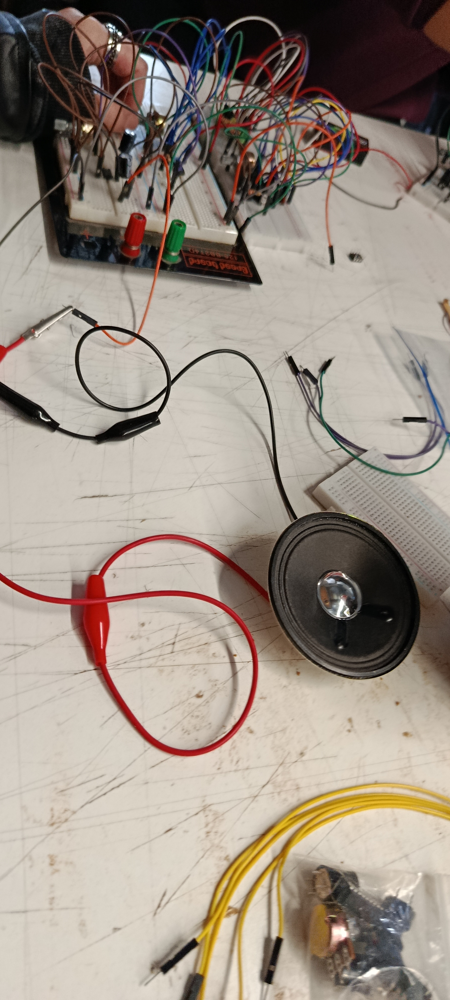

# sesion-06a
Clase 14 de abril

En esta clase no hay mucho que agregar en tema de apuntes, puesto que la clase en general nos enfocamos mas en lo que sería la primera evaluación del taller, en la que consiste ya empezar a con nuestro sintetizador o parecido.
 

Asi que procedere a explicar como nos fue en mi grupo. Primero intentamos hacer todo el circuito completo asi de principio, pero nos pasaba que al conectar todo no nos funcionaba como tal el sintetizador, pero al desconectar el sistema de las LEDS si funcionaba, y el sintetizador funcionaba tambien, pero por separado, no supimos como resolverlo en esta clase, cambiabamos cables y resistencias, y no habia ningun resultado, nos fuimos a las casas un pocos frsutrados porque no lo logramos completamente, pero sin perder la motivacion de poder lograrlo, ya que sabiamos que habia algo que habiamos hecho mal nosotros solo que debiamos descubrir que era para poder lograrlo...

*Imagen del esquema a seguir para el trabajo*

*Imagen del proceso de la clase*

## Entrega 24 de abril

Los primeros 3 son grupales, los siguientes 3 individuales:

1. **Factura del sintetizador**  
   Orden del circuito, limpieza, organización  

2. **Documentación textual**  
   Diagrama de bloques, esquemático, dibujos, explicación de cada parte  

3. **Modificaciones**  
   Decisiones de diseño, mejoras, parámetros, experiencia de uso  

4. Bitácoras marzo  

5. Bitácoras abril  

6. Presentación oral  

