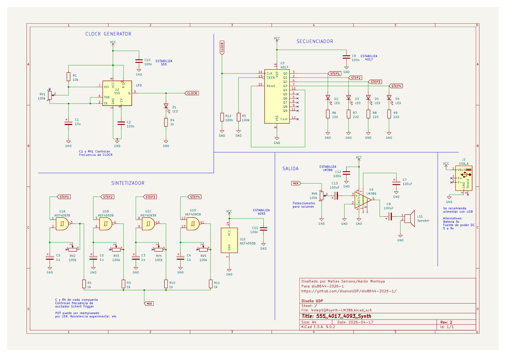
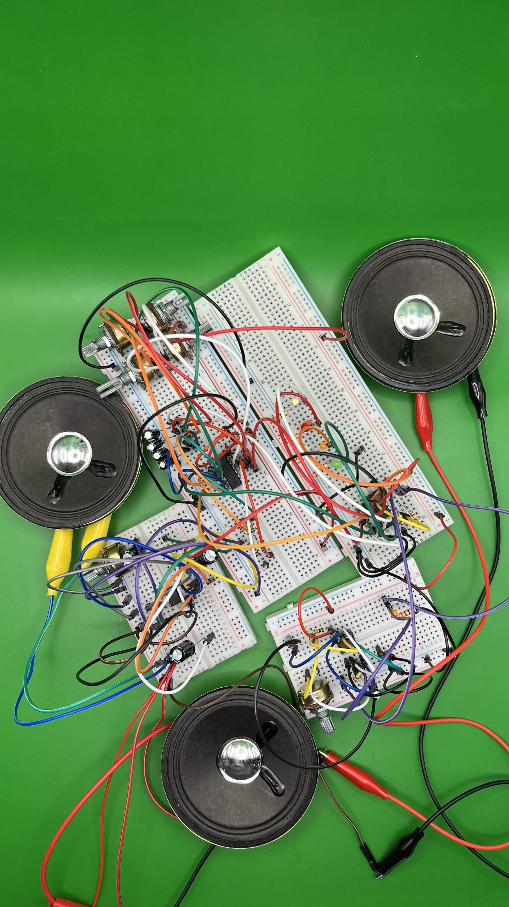

# sesion-06b
Clase 17 de abril 

## Durante la clase

En esta clase fue full trabajo en clase, tanto asi, que los profes nos dieron la libertad de tomarnos el break cuando nosotros estimaramos mejor. Pero esta clase para mi grupo fue un total triunfo, ya que el problema que teniamos la clase pasada, que los circuitos funcionaban por separado y no juntos, logramos solucionarlo y claro nos dimos cuenta que las posiciones de algunos clables que iban al chip no estaban en el lugar correcto del chip, corregimos este error y nos funciono, y fuimos lo más felices ya que despues de la frustración y todo logramos arreglar nuestro propio error. Tambien misa actualizo el esquematico, lo cual igual nos facilito el lograr el circuito completo.

*Esquematico final*

*Nuestro circuito logrado y nosotros felices*
