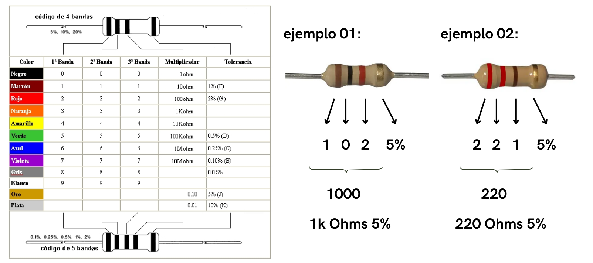
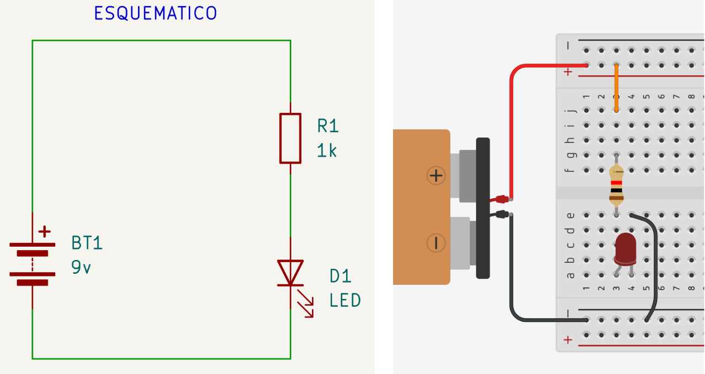
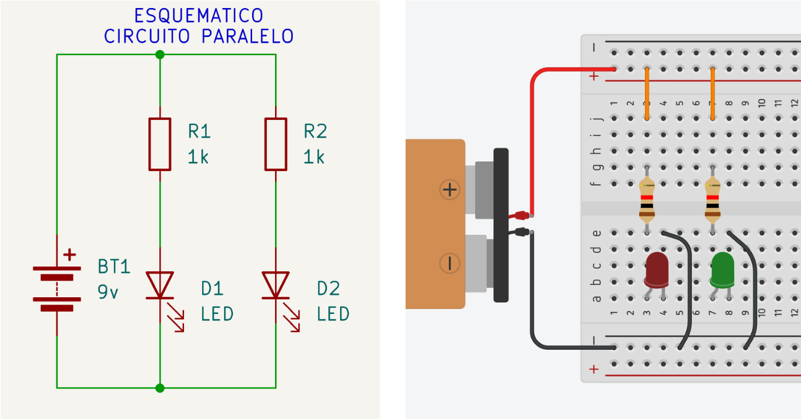
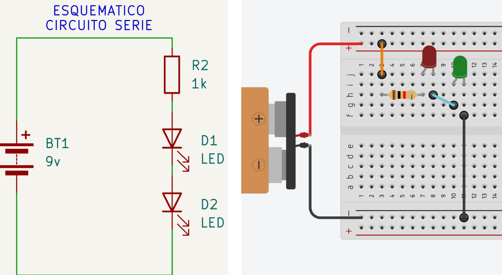
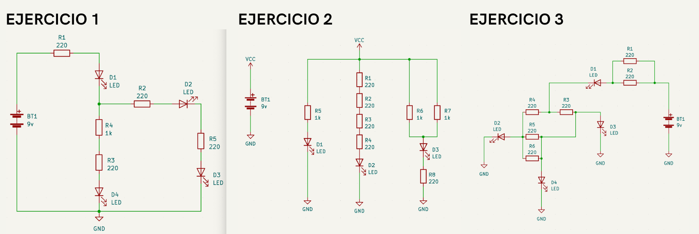
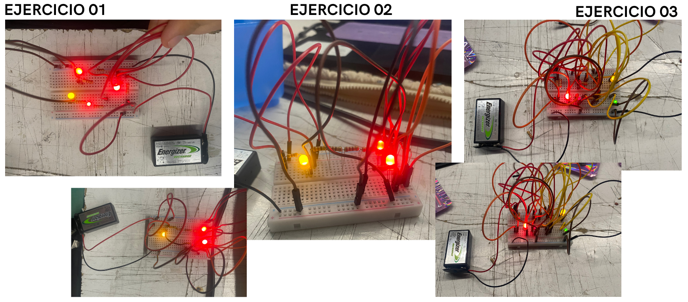
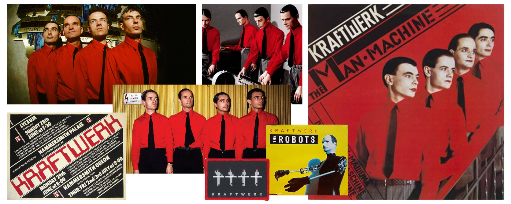
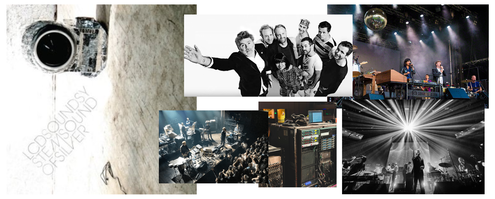

# sesion-02a

Martes de Marzo, 2026. 

Nota del día: brígido seguir la esquematización de los circuitos. 

## Referentes (y otras cosas)

- **LCD  Soundsystem** es una influyente banda estadounidense de dance-punk y rock electrónico formada en 2002 en Brooklyn, Nueva York. "liderado por el visionario James Murphy, es un proyecto de dance-punk y electrónica que marcó la escena musical desde su formación. Nacido en el contexto de la efervescente escena post-punk de la ciudad, Murphy, junto a colaboradores como Nancy Whang (teclados, voz), Pat Mahoney (batería) y Tyler Pope (bajo), fusionó punk, disco y electrónica con letras introspectivas. Su debut, LCD Soundsystem (2005, DFA Records), con éxitos como Daft Punk Is Playing at My House, alcanzó el puesto 20 en la UK Albums Chart y fue nominado al Grammy como Mejor Álbum de Danza/Electrónica. Sound of Silver (2007)"- <https://lcdsoundsystem.com/> / <https://www.youtube.com/channel/UC8NRkSpKUuy6GBwFL6nu6PQ> / <https://www.instagram.com/lcdsoundsystem/> / Canción escuchada en clase _"you wanted a hit"_: <https://youtu.be/_1c1zhV3vHk> / información relevante: <https://www.grammy.com/news/lcd-soundsystem-remains-essential-live-electronic-band>
- **James Murphy** es un músico, multinstrumentista, cantante, compositor, productor discográfico y DJ estadounidense.
- **DFA Records** es una compañía discográfica independiente estadounidense formada en 2001 por el músico y productor británico Tim Goldsworthy, el músico del grupo estadounidense de rock LCD Soundsystem, James Murphy y el actor Jonathan Galkin que anteriormente fue actor en la famosa cadena televisiva de niños, Nickelodeon. Es una de las etiquetas más influyentes en la escena del dance-punk e indie rock de principios del siglo XXI. - <https://store.dfarecords.com/> / <https://www.instagram.com/dfarecs/>
- **Kraftwerk** es una banda alemana de música electrónica, formada por Ralf Hütter y Florian Schneider en 1970 en Düsseldorf. Según wikipedia Kraftwerk (Central Eléctrica) fue uno de los primeros grupos en popularizar la música electrónica, considerados pioneros del género e influencia en muchos subgéneros de la música electrónica, como el dance, house, trance, italo-dance, eurodance, entre otros. En la década de 1970 y principios de los años 1980, el sonido distintivo de Kraftwerk fue revolucionario, y ha tenido un efecto duradero a través de muchos géneros de la música moderna. _"El característico sonido de Kraftwerk, combina ritmos repetitivos con melodías pegadizas, principalmente siguiendo un estilo clásico occidental de la armonía, con una instrumentación minimalista y estrictamente electrónica. Las letras simplificadas del grupo son a veces cantadas a través de un vocoder o generadas por un sintetizador de habla con la intención de intensificar el tono profético de su sonido"._ - (me recuerdan demasiado a la bauhaus) _"comparten una profunda afinidad estética y conceptual con la escuela de diseño Bauhaus, basándose en el funcionalismo, la precisión maquinal, la "máquina humana" y el modernismo vanguardista. Su estética minimalista y robótica refleja la unión del arte y la tecnología"._ - (es una lástima que hayan estado en chile hace tan pocos años y recién los vengo a conocer) <https://kraftwerk.com/> / Kraftwerk - The Robots (Official Video) <https://youtu.be/D_8Pma1vHmw>
- **Hainbach** Stefan Paul Goetsch, más conocido por el alias Hainbach, es un youtuber y compositor alemán de música electrónica experimental, residente en Berlín. Es conocido principalmente por su canal homónimo de YouTube, creado en 2011.​ _"Based out of Berlin, Germany, electronic music composer and sound artist Hainbach creates shifting audio landscapes THE WIRE called "One hell of a trip". He has been fascinated with electronic sounds since he discovered the dial on the radio. Never losing his childhood wonder, he still searches for the sounds in between on uncommon electronic instruments, tape and test equipment, making even the “unmusical musical”. Through his YouTube channel Hainbach brings experimental music techniques to a wider audience. He is an award winning film composer, and his compositions for ensembles have been featured at Witten, Gaudeamus and Impulsfestival Halle. His music software and hardware is used by musicians world-wide."_ - <https://www.youtube.com/channel/UCeovElJP0n0i8ADaPsRSd8g> / <instagram.com/hainbach101> / <hainbachmusik.com>
- **Musique concrete** _is a genre of electroacoustic music developed in the 1940s by Pierre Schaeffer that uses recorded "concrete" sounds—such as environmental noise, machinery, or voices—as raw material rather than traditional musical instruments. Sounds are manipulated via tape, including splicing, reversing, and speed changes, to create sound collages or "sound objects" (objets sonores)._ - "En este género , los sonidos de origen natural, animados e inanimados, se graban y manipulan de manera que los sonidos originales se distorsionan y combinan de forma musical. Los medios de manipulación incluyen cambiar la velocidad de reproducción para alterar el tono, reproducir la cinta al revés, cortar la cinta para ejercer un control preciso sobre la duración, filtrar o reforzar ciertas frecuencias de ondas sonoras y otras manipulaciones más complejas. "
- **Pierre Schaeffer** fue un compositor, ingeniero y teórico francés, reconocido mundialmente como el padre de la música concreta. Su enfoque revolucionó la creación sonora al proponer que cualquier sonido del mundo real puede ser material musical si se separa de su fuente original. Su legado es el pilar de técnicas modernas como el sampling y ha influido profundamente en géneros que van desde la música electrónica de vanguardia hasta el hip-hop. 
- **Tratado de objetos musicales** (libro) Según gemini es la obra teórica fundamental de Pierre Schaeffer. Este libro es considerado uno de los textos más influyentes en la música del siglo XX, ya que redefine la relación entre el sonido, la tecnología y la percepción humana. Conceptos Clave del Libro: "El Objeto Sonoro" que se define como un fragmento de sonido percibido como una unidad independiente de su origen físico (por ejemplo, el sonido de una campana grabado y manipulado, separado de la campana real). "La Música Concreta" que es el tratado sistematiza el método de componer utilizando sonidos grabados de la realidad (objetos "concretos") en lugar de notas escritas en una partitura tradicional. "Las Cuatro Escuchas" que propone diferentes niveles de percepción sonora: oír (ouïr), escuchar (écouter), entender (entendre) y comprender (comprendre). "Enfoque Interdisciplinario" La obra aborda el sonido desde perspectivas históricas, lingüísticas, físicas, filosóficas y metodológicas.
- **Felipe Cuseen** Escritor, músico y profesor. Dentro de sus producciones figuran libros de poesía y narrativa, poemas visuales, poemas sonoros, videos y performances. - <https://www.felipecussen.net/> / <https://www.instagram.com/felipecussen/>
- **La oficina de la nada** (festival de libros en blanco) - <https://www.instagram.com/laoficinadelanada/> - "Esta oficina abre sus puertas para compartir un extraño tesoro de cajas vacías, libros en blanco y papeles arrugados que hablan de la ausencia y la inutilidad, pero también de la sorpresa y la alegría ante las infinitas posibilidades de la nada". 
- **Arquitectura de las transferencias: arte, política y tecnología** es una obra editada por la artista e investigadora chilena Ingrid Wildi Merino, publicada originalmente en 2016 por Abada Editores. El libro propone una reflexión crítica sobre cómo la "materia prima" y los procesos tecnológicos actúan como ejes vertebradores de la historia y el presente, enfrentando desafíos sociales, políticos y culturales. 

## Qué aprendí hoy

- **Importante:** No es que algunos materiales conduzcan electricidad y otros no, sino que todos presentan cierto grado de conducción, pero unos ofrecen menor resistencia (conductores) y otros mayor resistencia (aislantes). Es decir, algunos materiales permiten el paso de la electricidad con mayor facilidad que otros.
- **Elementos conductores:** hierro, plata, oro, cobre, aluminio.
- **Elementos aislantes:** vidrio, tierra, plástico, madera, cuero.
  - El **cobre** es uno de los conductores más eficientes, por lo que se utiliza ampliamente en la fabricación de **cables eléctricos**. Por otro lado, el **carbón** se emplea con frecuencia en **resistencias** debido a su mayor oposición al paso de la corriente.

### Sobre resistencias... 

El término resistencias se refiere principalmente a componentes electrónicos (también llamados resistores) que limitan el flujo de corriente en un circuito. Su valor se mide en **ohmios (Ω)** y es fundamental para proteger otros componentes más sensibles, como los LEDs. Su función es oponerse al paso de los electrones, regulando la intensidad y dividiendo voltajes.

Se suelen identificar mediante un código de colores impreso en bandas sobre su cuerpo, lo que indica su valor y tolerancia - Las resistencias tienen 4 (o 5) rayitas de diferentes colores: al ser tan pequeños es mejor reconocerlos por colores asociados a los números que poner los datos como tal en el objeto.

- Primer color es el **primer número**.
- Segundo color es el **segundo número**.
- Tercer color es la **cantidad de ceros** que tendrá el número final.
- Cuarto color es la **tolerancia**.

Para calcular el valor de una resistencia según sus bandas de colores, puedes usar calculadoras en línea como las de: [digikey](https://www.digikey.com.mx/es/resources/conversion-calculators/conversion-calculator-resistor-color-code) o ver la tabla de colores o utilizar un multímetro (herramienta física). 

### Circuitos 

Un circuito eléctrico es un conjunto de componentes conectados entre sí que forman una trayectoria cerrada, permitiendo que la corriente eléctrica (un flujo de electrones) circule y transforme la energía en otros efectos, como luz, calor o movimiento.

El comportamiento de un circuito se rige por la Ley de Ohm, que relaciona tres variables: 

- **Voltaje (V):** La fuerza que impulsa a los electrones (medido en voltios).
  - V = I x R
- **Intensidad (I):** La cantidad de electrones que pasan por un punto por segundo (medido en amperios).
  - I = V / R
- **Resistencia (R):** La oposición que ofrece el circuito al paso de la corriente (medida en ohmios).
  - R = V / I
 
Todo circuito elemental requiere al menos tres elementos clave para funcionar: 

- **Generador o fuente:** Proporciona la energía y el voltaje necesario, como una pila o batería.
- **Conductores:** Cables (generalmente de cobre) que transportan la electricidad a través del circuito.
- **Receptor o carga:** Dispositivo que consume la energía y la transforma (ej. una ampolleta, un motor o un LED).
  
La **esquematización de un circuito** es la representación gráfica simplificada de una instalación o dispositivo eléctrico mediante el uso de símbolos normalizados. A diferencia de un dibujo artístico, el esquema no busca mostrar el aspecto real de los componentes, sino cómo están conectados lógicamente.

Nombres/simbología: 

- GND = ground (tierra).
- V = voltaje.
- BT = batería. 
- VCC = voltaje de alimentación / corriente continua.
- R = resistencia.
- D = LED.

tipos de circuitos: 

#### Circuito básico

Es la unidad mínima necesaria para que algo funcione.

- **Composición:** Solo tiene un generador, un receptor (como una ampolleta) y un interruptor.
- **Uso:** Sirve para entender el concepto de "trayectoria cerrada" antes de añadir más complejidad.

#### Circuito paralelo

Los componentes se conectan a los mismos puntos de entrada y salida, creando "ramas" - Los componentes se conectan de forma independiente. Si uno falla, los demás siguen funcionando.

- **Cómo funciona:** La corriente se divide al llegar a un nodo y se vuelve a unir después.
- **Si uno falla**: Los demás siguen funcionando perfectamente. Es el sistema que se usa en las casas.
- **Voltaje**: Todos los componentes reciben la misma fuerza (voltaje completo de la fuente).

#### Circuito serie

La corriente tiene un solo camino - Los componentes se colocan uno tras otro en la misma línea.

- **Cómo funciona**: La corriente debe atravesar todos los receptores para completar el recorrido.
- **Si uno falla**: El circuito se corta. Si se quema una bombilla, todas las demás se apagan (como las luces de Navidad antiguas).
- **Voltaje**: Se reparte entre los componentes; cuantas más bombillas pongas, menos luz darán.

resumen: 

| Característica       | Serie                    | Paralelo                   |  
|----------------------|--------------------------|----------------------------|
| Caminos de corriente | Uno solo                 | Múltiples                  |
| Independencia        | Dependientes entre sí    | Independientes             |   
| Resistencia total    | Aumenta al añadir piezas | Disminuye al añadir piezas | 

## Ejercicio: LQXTLC

Armar distintos esquemáticos en su protoboard. Documentar que pasa con cada D (LED) si retiro cada R (RESISTENCIA). Nombra el apagado como "0" y el encendido como "1". Ejemplo: Si quito "R5", solo se apaga "D3". El resto se mantiene encendida.

### Ejercicio 1

| loquitoportilocoloco  | D1    | D2    | D3    | D4    |
| ---                   | ---   | ---   | ---   | ---   |
| R1                    |    0  |   0   |   0   | 0     |
| R3                    |    1  |    1  |  1    |    0  |
| R4                    |1      | 1     |  1    |    0  |
| R2                    |   1   |  0    | 0     |   1   |
| R5                    |    1  |   0   |  0    |   1   |

### Ejercicio 2

| loquitoportilocoloco | D1 | D2 | D3 |
| -------------------- | -- | -- | -- |
| R1                   |  1 |  0 |  1 |
| R2                   |  1 |   0| 1  |
| R3                   |  1 |  0 | 1  |
| R4                   |  1 |  0 |   1|
| R5                   |  0 |  1 |  1 |
| R6                   | 1  |  1 |  1 |
| R7                   |  1 |  1 |  1 |
| R8                   |  1 |  1 |  0 |

### Ejercicio 3

| loquitoportilocoloco | D1 | D2 | D3 | D4 |
| -------------------- | -- | -- | -- | -- |
| R1                   | 1  | 1  | 1  |  1 |
| R2                   | 1  |  1 |  1 |  1 |
| R3                   |  1 |  1 |  0 |  0 |
| R4                   |  1 |  1 |  1 |  1 |
| R5                   |  1 |  1 |  1 |  1 |
| R6                   |  1 |  1 |  1 |  1 |

- ejercicios realizados con [@19-Nicolas-Miranda1312](https://github.com/disenoUDP/dis8644-2026-1/tree/main/19-Nicolas-Miranda1312/sesion-02a)
-  El ejercicio 3 se ve "lleno de cables" porque en la primera aproximación a su realización fue la forma en la que pude entender cómo hacerlo, pero después realizamos una versión más simplificada (sin tantos cables), pero se me olvidó sacarle fotos :C 

## Encargo-02a 

Elegir un disco particular de Kraftwerk, investigar avances de esa era, contexto de grabación, revisar presentaciones en vivo de esa época y contrastar con actuales. explicar qué escuchas en el disco, qué te llama la atención, describir en largo, no en corto + lo mismo pero con un disco de LCD Soundsystem.

### Kraftwerk

Kraftwerk es un grupo alemán formado en Düsseldorf a comienzos de los años 70, liderado por Ralf Hütter y Florian Schneider. Desde sus inicios, el proyecto se propuso romper con la tradición del rock anglosajón dominante, buscando construir una identidad sonora propia, ligada a la **modernidad europea, la tecnología y la vida urbana**. En ese sentido, Kraftwerk no solo es una banda, sino un proyecto artístico que articula música, diseño, arquitectura sonora y pensamiento cultural.

Su propuesta se basa en una reducción radical de los elementos musicales, tales como **ritmos mecánicos, estructuras repetitivas, melodías simples y una voz que muchas veces se presenta procesada o deshumanizada**. Sin embargo, esta aparente simplicidad esconde un trabajo extremadamente detallado en términos de producción. El uso de **sintetizadores, secuenciadores y cajas de ritmo** no busca imitar instrumentos tradicionales, sino generar un lenguaje propio, donde la máquina no es un medio, sino el centro mismo del discurso.

Una de las claves de Kraftwerk es su capacidad de construir una estética total. La banda no solo suena como una máquina, también se presenta como tal. Su imagen (trajes uniformes, posturas rígidas, incluso el uso de maniquíes robóticos en escena) refuerza la idea de que **los músicos son extensiones de un sistema automatizado**. Esta coherencia entre forma y contenido es lo que los convierte en una referencia fundamental dentro de la cultura contemporánea.

Su influencia es transversal. Como señalan múltiples fuentes, gran parte de la música electrónica posterior (techno, house, synthpop) no se puede entender sin Kraftwerk. Incluso géneros aparentemente lejanos, como el hip-hop, han tomado elementos de su obra (por ejemplo, el uso de ritmos programados y repetitivos). 

#### The Man-Machine (Die Mensch-Maschine) (1978)

Canciones: 

- The Robots. (Die Roboter) (mi fav)
- Spacelab. 
- Metropolis. 
- The Model. (Das Model)
- Neon Lights. (Neonlicht) (mi 3° fav)
- The Man machine. (Die Mensch-Maschine) (mi 2° fav)

#### Contexto de grabación

The Man-Machine se desarrolla en un momento donde Kraftwerk ya había consolidado su lenguaje, pero decide llevarlo a un nivel de síntesis aún más radical. Grabado en su estudio propio, Kling Klang, en Düsseldorf, el álbum refleja una búsqueda obsesiva por el control total del sonido, cada ritmo, cada textura y cada repetición están cuidadosamente diseñados. Este nivel de precisión no solo responde a una inquietud técnica, sino también a una idea estética muy clara, profundamente conectada con corrientes artísticas del siglo XX como la Bauhaus y el constructivismo ruso.

En el caso de la Bauhaus, su influencia se puede ver en la forma en que Kraftwerk entiende la relación entre arte, tecnología y funcionalidad. La Bauhaus proponía eliminar lo ornamental para centrarse en lo esencial, integrando arte, diseño e industria en un mismo lenguaje. Esto se refleja directamente en el disco, las canciones están construidas con elementos mínimos, repetitivos y funcionales, donde cada sonido cumple un rol específico dentro del sistema. No hay exceso ni decoración; todo está reducido a su forma más eficiente.

Por otro lado, el Constructivismo ruso aporta una dimensión más ideológica y visual. Este movimiento, surgido tras la revolución rusa, promovía un arte orientado a la modernidad, la industria y la colectividad, utilizando formas geométricas, tipografías fuertes y composiciones estructuradas. En The Man-Machine, esto se traduce no solo en la música, sino también en la estética del álbum, la portada, los colores (especialmente el rojo y negro), la disposición de los cuerpos y la idea de los músicos como “unidades” dentro de un sistema remiten directamente a este imaginario.

A fines de los años 70, Europa vivía una fuerte transformación tecnológica y cultural: la automatización industrial, el desarrollo de computadoras y la expansión de los medios electrónicos comenzaban a redefinir la vida cotidiana. Kraftwerk no solo observa estos cambios, sino que los convierte en el eje central de su obra. El álbum plantea una pregunta fundamental: **¿qué significa ser humano en una era dominada por máquinas?** , el mismo titulo _“El hombre-máquina”_ resume esta tensión. No se trata de una oposición entre humano y tecnología, sino de una fusión. Esta idea se refleja tanto en el sonido como en la estética visual del disco, influenciada por movimientos como el constructivismo ruso y la Bauhaus, donde la funcionalidad, la geometría y la repetición son elementos centrales.

En este contexto, el uso del alemán y el inglés también adquiere relevancia. No solo permite una mayor difusión internacional, sino que refuerza la idea de una identidad híbrida, es algo local y global, algo humano y mecánico. Todo en el álbum (desde el sonido hasta la imagen) responde a una misma lógica de síntesis, donde influencias artísticas, avances tecnológicos y reeflexiones culturales se integran en un sistema coherente.

#### Qué significó su avance 

El impacto de The Man-Machine es profundo y duradero. En términos musicales, el álbum establece un modelo basado en la repetición, la precisión y la economía de recursos. Este enfoque influye directamente en el desarrollo del techno en Detroit, el house en Chicago y el synthpop en Europa. Pero su avance no es solo técnico, sino también conceptual. Kraftwerk redefine la relación entre música y tecnología: **ya no se trata de usar máquinas para hacer música, sino de pensar la música desde la lógica de la máquina**. Esto implica un cambio radical en la forma de componer, producir e incluso interpretar en vivo.

Diversos análisis coinciden en que Kraftwerk logra algo excepciona, transformar lo experimental en accesible. Canciones como The Model funcionan dentro de estructuras cercanas al pop, pero construidas desde una lógica completamente distinta. Esto permite que su propuesta llegue a un público amplio sin perder complejidad. También es importante su influencia visual. La idea de una identidad artística coherente, donde sonido, imagen y concepto están completamente integrados, se vuelve fundamental para generaciones posteriores. En ese sentido, Kraftwerk no solo influye en músicos, sino también en diseñadores, artistas visuales y productores.

Finalmente, su legado se puede entender como la creación de una nueva sensibilidad cultural, una forma de pensar la modernidad, la tecnología y la identidad en un mundo cada vez más mediado por máquinas.

#### Antes v/s Ahora 

- 1978: Kraftwerk - The Robots (Live, Club Lido, Venice October 1978) (Better Quality) <https://youtu.be/BcJ1q0c1F4g>
- 1978: Kraftwerk - The Robots / Radioactivity Live 10/1/1978 Théâtre De L'Empire Paris <https://youtu.be/g-7LrvXO5hA>
- 2004: Kraftwerk - The Robots (Chile, 2004) <https://youtu.be/OgIf7hiZ3Wg>
- 2014: Kraftwerk 3D - The Robots (Live) HD <https://youtu.be/a3TizRqvdsk>
- 2025: Kraftwerk - 'The Robots' (Live, 7 March 2025) <https://youtu.be/37bWPr6W-O8>

En las presentaciones de finales de los 70, como las de 1978 en París o Venecia, Kraftwerk ya tenía súper clara su propuesta, pero todavía se sentía muy “cruda” en términos escénicos. The Robots se interpretaba de forma extremadamente contenida, los integrantes casi no se movían, estaban alineados detrás de sus equipos y toda la atención recaía en el sonido. No había una intención de espectáculo en el sentido tradicional, sino más bien de generar una atmósfera fría y precisa, reforzando el concepto de “hombre-máquina”. El público quedaba en un rol bastante pasivo, como observando un sistema funcionar más que interactuando con una banda.

En 2004, por ejemplo en el show en Chile, aparece un cambio importante pero muy coherente con lo que venían planteando. Durante The Robots, la banda directamente desaparece del escenario y es reemplazada por robots/maniquíes con cabezas plásticas que simulan ser los integrantes. Este momento es clave porque ya no se trata solo de “actuar como máquinas”, sino de literalmente ser sustituidos por ellas. Los movimientos mecánicos de estas figuras, sincronizados con la música, refuerzan la idea de que el humano es prescindible dentro del sistema. Kraftwerk lleva su propio concepto al límite, haciendo que la performance funcione incluso sin ellos presentes físicamente.

Para 2014, con el formato de Kraftwerk 3D, el show da otro salto, pero sin perder su esencia. La banda sigue igual de estática y controlada, pero todo lo que pasa alrededor crece muchísimo. Las visuales en 3D, las proyecciones y la sincronización con la música hacen que The Robots ya no sea solo una canción, sino una experiencia completamente inmersiva. El público deja de ser solo espectador y pasa a estar metido dentro del sistema visual y sonoro.

En las presentaciones más recientes, como en 2025, lo que se ve es más bien una consolidación de todo lo anterior. No hay un cambio radical, sino un refinamiento (mejorar lo que ya venían haciendo). La tecnología es más avanzada, las pantallas y visuales son más nítidas, y la sincronización es aún más precisa, pero la lógica sigue siendo la misma. 

#### Mi opinión ¿?

Al escuchar The Man-Machine de Kraftwerk, lo primero que me pasó fue pensar que todo el disco iba a ir por el mismo lado que The Robots. Esa cosa de sonidos que se repiten, que entran de a poco y se van sumando como capas (casi como un “asmr electrónico"). Esa primera impresión te deja con la idea de que el álbum completo va a ser súper homogéneo, como si todas las canciones funcionaran bajo la misma lógica.

Pero a medida que lo fui escuchando mejor, me di cuenta de que no es tan así. Si bien hay una base común (repetición, ritmo medio mecánico) la mayoría de las canciones se despegan harto de The Robots. Por ejemplo, Spacelab o Metropolis (que son las que menos me gustaron) tienen otras texturas, otros sonidos que duran más, que no son solo loops cortos sino que construyen ambientes más largos. Incluso Neon Lights se siente mucho más extendida y atmosférica. La excepción más clara sería The Man-Machine, que sí se acerca más a esa lógica repetitiva y robótica del inicio.

Algo que me gusta mucho es el uso de las voces con el filtro "robotico", no son voces expresivas en el sentido típico, pero justamente por eso funcionan tan bien, suenan procesadas, planas, casi sin emoción (a veces), y eso hace que calcen perfecto con el concepto. No es solo la letra hablando de máquinas, sino que la voz misma, alineada con los ritmos, los sintetizadores, todo hace que las canciones suenen como una máquina, lo que deja muy en claro la idea del álbum.

También encuentro muy interesante el “juego de sonidos” que tiene el disco. Hay momentos donde entran y salen capas, donde pequeños detalles se van sumando y hacen que la canción crezca sin que te des cuenta tanto. Se nota que hay harto trabajo en cómo se organizan los elementos de repetición y no es solo repetir por repetir, sino que cada repetición va construyendo algo más grande en su conjunto. Mis canciones favoritas igual muestran eso. The Robots es la que más me gusta porque es como la base de todo el concepto, la más directa en esa idea de máquina. 

### LCD Soundsystem

LCD Soundsystem es un proyecto liderado por James Murphy que surge a comienzos de los 2000 en Nueva York, vinculado al sello DFA Records. Desde sus inicios, la banda se caracterizó por mezclar **electrónica, punk, disco y rock** en una propuesta híbrida muy consciente de su lugar dentro de la historia de la música. Su sonido **combina lo bailable con lo reflexivo**, utilizando **estructuras repetitivas** y una construcción progresiva que va acumulando intensidad emocional a lo largo de sus canciones.

Una de sus características más distintivas es el uso explícito de técnicas de producción: **sintetizadores, cajas de ritmo y equipos de grabación** se presentan casi sin ocultarse (parte del discurso artístico). En ese sentido, LCD Soundsystem no solo crea música, sino que también dialoga con sus influencias, “citando” y reinterpretando sonidos de bandas como Kraftwerk, Can y Suicide. Esto permite que su obra funcione como una especie de mapa o genealogía del sonido underground.

En términos de contenido, la banda destaca por trabajar una tensión constante entre forma y fondo. Sus canciones suelen abordar temas como la ansiedad, el paso del tiempo, la pérdida y el miedo al fracaso, pero lo hacen a través de ritmos bailables y accesibles. Como señala Bárbara Carvacho, se trata de “una agrupación que logra retratar los rincones más oscuros del humano, de la droga, de la pérdida, del miedo al fracaso, del miedo a perder. Todo disfrazado de hit bailable”. Esta dualidad es clave para entender su impacto emocional y su conexión con el público.

Su discografía principal incluye LCD Soundsystem (2005), Sound of Silver (2007), This Is Happening (2010) y American Dream (2017). A través de estos trabajos, consolidaron un estilo que no solo definió su identidad, sino que también influyó en múltiples artistas posteriores.

Finalmente, su importancia dentro de la música indie radica en haber logrado una síntesis entre distintas tradiciones musicales underground y haberlas llevado a un público más amplio. LCD Soundsystem no solo fue pionero en el desarrollo del dance-punk o el “disco de garage”, sino que también abrió un camino para que sonidos menos comerciales pudieran instalarse en el panorama musical contemporáneo, influyendo en el futuro del indie.

como extra: LCD Soundsystem funciona más como un colectivo liderado por Murphy que como una banda fija, pero estos son sus integrantes más reconocidos (especialmente en la era de Sound of Silver y presentaciones en vivo):

- James Murphy – voz, producción, multiinstrumentista.
- Nancy Whang – teclados, sintetizadores, coros.
- Pat Mahoney – batería.
- Tyler Pope – bajo, guitarra.
- Al Doyle – guitarra, sintetizadores.
- Phil Mossman – guitarra, bajo (etapa inicial).

#### Sound of Silver (2007)

Canciones: 

- Get Innocuous!
- Time to Get Away. 
- North American Scum. (mi fav)
- Someone Great. 
- All my friends. 
- Us V Them. (mi 2° fav) 
- Watch the Tapes.
- Sound of Silver. 
- New York, I Love You but You´re Bringing Me Down. (mi 3° fav)

#### Contexto del álbum

El segundo álbum de LCD Soundsystem, Sound of Silver, publicado el 12 de marzo de 2007 en formatos CD, vinilo y descarga digital bajo los sellos DFA Records, Capitol Records y EMI, surge en un momento decisivo para el proyecto liderado por James Murphy. Tras el reconocimiento de su debut, Murphy enfrenta la necesidad de consolidar una propuesta que vaya más allá de la novedad inicial, dando paso a un trabajo más cohesionado, ambicioso y emocionalmente honesto.

La creación de Sound of Silver está profundamente marcada por un contexto personal y generacional. Murphy, en una etapa más adulta que muchos de sus contemporáneos dentro de la escena indie, comienza a reflexionar sobre la nostalgia y el miedo a quedarse atrás. El disco se configura así como un registro emocional que, aunque envuelto en ritmos accesibles, aborda preocupaciones existenciales muy concretas.

El álbum tuvo una recepción crítica altamente positiva, posicionándose entre los trabajos más destacados de su año. Alcanzó el puesto número 46 en el Billboard 200 y fue nominado al Grammy al Mejor Álbum Electrónico/Dance, además del Shortlist Music Prize. Según Metacritic, se ubicó entre los discos mejor evaluados de 2007. Entre sus sencillos, destaca especialmente All My Friends, considerada por Pitchfork y Rolling Stone como una de las mejores canciones de la década.

“All My Friends” se convierte en el núcleo conceptual del álbum, condensando su propuesta estética y emocional. Su videoclip, dirigido por Jonathan Bines, presenta una puesta en escena minimalista basada en un plano continuo de James Murphy, donde los cambios de iluminación acompañan la intensidad de la canción y refuerzan su carga emocional. (LCD Soundsystem - All My Friends (Official Video) <https://youtu.be/aygY5OqMuKE> )

Sound of Silver representa una evolución clave dentro de la trayectoria de LCD Soundsystem, consolidando un enfoque más maduro y ambicioso que amplía el alcance emocional y conceptual de su música.

#### Qué significó su avance 

El impacto de Sound of Silver de LCD Soundsystem radica principalmente en haber redefinido el lugar de la música bailable dentro del indie. Más que introducir una fusión nueva, el álbum consolidó esta mezcla como un lenguaje capaz de transmitir profundidad emocional, influyendo en la forma en que otros artistas comenzaron a abordar la electrónica desde una perspectiva más introspectiva. Asimismo, el disco funcionó como un puente cultural, ampliando el alcance de sonidos y referencias provenientes de escenas underground hacia audiencias más masivas. Esto contribuyó a que ciertas estéticas y formas de producción, antes más marginales, se integraran con mayor naturalidad en la música contemporánea. Por otra parte, su avance también fue conceptual: ayudó a instalar una sensibilidad más madura dentro del indie, donde temas como la nostalgia, la adultez y la incertidumbre adquirieron un lugar central. De este modo, Sound of Silver no solo influyó en lo musical, sino también en las temáticas y enfoques desde los cuales se construye la música popular actual.

#### Antes v/s Ahora

- 2007: LCD Soundsystem :: All My Friends (Live on Later) <https://youtu.be/FlogJqMFaYA>
- 2011: LCD Soundsystem. Live at Madison Square Garden, 2011. Part 1 <https://youtu.be/hB2zZFF52Do>
- 2018: LCD Soundsystem - Best Kept Secret Festival 2018 (2024 Upload) <https://youtu.be/25uRAnLGfuw>
- 2025: LCD Soundsystem (Live at Primavera Sound 2025 Barcelona) <https://youtu.be/zCD8gKvFLZQ>

En la presentación de 2007 LCD Soundsystem aparece en una etapa inicial de consolidación en vivo. La interpretación de All My Friends es contenida, con una puesta en escena minimalista y una ejecución muy apegada al estudio. James Murphy se muestra más introspectivo, casi estático, y el foco está completamente en la música. Esta versión en especifico fue algo televisado por lo que La audiencia cumple un rol pasivo, lo que refuerza la sensación de estar presenciando una banda que aún está definiendo su identidad escénica.

Para 2011, en el concierto de despedida en el Madison Square Garden, se percibe un cambio importante. La banda alcanza un punto de madurez donde la interpretación se vuelve mucho más emocional y expansiva. La canción deja de ser solo una pieza musical para transformarse en un momento colectivo cargado de significado, tanto para la banda como para el público. La energía es más intensa, el clímax más explosivo y Murphy adopta una presencia más segura, consciente del peso simbólico del momento.

En 2018, durante el Best Kept Secret Festival, se evidencia una etapa intermedia tras el regreso de la banda. La performance mantiene la intensidad lograda en 2011, pero ahora con un sonido más pulido y controlado. La banda suena más sólida y precisa, con una mayor integración de capas y matices. La relación con el público sigue siendo activa, pero menos cargada de la emoción de “despedida” y más enfocada en la experiencia del show como tal. Se percibe una banda que ya domina su lenguaje en vivo y lo ejecuta con consistencia.

Finalmente, en 2025 en Primavera Sound, la presentación alcanza una escala completamente distinta. El show se convierte en una experiencia inmersiva, donde la iluminación, la puesta en escena y la energía del público juegan un rol central. “All My Friends” funciona plenamente como un ritual colectivo, el público canta, se apropia de la canción y completa su sentido. Murphy se muestra totalmente suelto y en control, y la banda opera como un mecanismo perfectamente aceitado. 

#### Mi opinión ¿?

Al escuchar este disco de LCD Soundsystem, lo primero que me llama la atención es cómo logra sostener una energía constante sin volverse monótono. Hay una base rítmica muy marcada, casi como un “tum tum tum” continuo, que atraviesa varias canciones, pero cada una construye su propia identidad dentro de esa o su propia repetición. No suenan iguales entre sí, sino que cada canción desarrolla su propio clima/estilo, lo que hace que el disco se sienta coherente pero no plano.

Mis canciones favoritas reflejan bastante bien esa variedad. _North American Scum_ es la que más disfruto, probablemente por su energía más directa y su actitud algo irónica. Luego _Us V Them_ me atrapa porque no es solo la melodía muy repetitiva y marcada sino que lo que se va cantando suena igual acompañando los instrumentos, todo en la canción se va repitiendo todo el tiempo, y _New York, I Love You but You’re Bringing Me Down_ destaca por cerrar con una carga emocional mucho más explícita, casi como un contraste necesario dentro del disco (la primera vez que la escuché no me gustó mucho, pero con el tiempo fue la que más se me quedó pegada; sobre todo me gusta cómo va subiendo en intensidad hasta el final, que es la parte que más me gusta).

Algo que encuentro muy interesante es cómo algunas canciones, especialmente _All My Friends_, generan una sensación de nostalgia en movimiento. No es una nostalgia estática o triste, sino que va avanzando, creciendo, acumulándose. Esto tiene mucho que ver con la forma en que están construidas, la intensidad no está al inicio, sino que se desarrolla progresivamente hasta el final, lo que hace que la experiencia sea más emocional.

También me gusta mucho poder identificar momentos donde aparece la voz de Nancy Whang, ya que aporta un contraste interesante dentro del sonido general de la banda. En términos más generales, algo que suele destacarse de este álbum y que también noto al escucharlo es su equilibrio entre lo emocional y lo bailable (alho que también se menciona demasiado en las fuentes donde se habla de la banda). No es solo música para escuchar ni solo para bailar, sino que funciona en ambos niveles al mismo tiempo (la primera vez que la escuche iba camino a la u y debo admitir que fui casi todo el recorrido con las ganas de bailar, estuve muy metida en como sonaba y aunque no entendía lo que decían algunas canciones disfrutaba la sensación de alegría o la retrospección que estas dejaban). Además, tiene una estética muy consciente de sus referencias, se notan influencias de la música electrónica más antigua y del rock alternativo, pero están integradas de una forma que no se siente como copia, sino como reinterpretación (algunas veces me pasaba que sentía que ciertas partes de algunas canciones me sonaban muy similares a otras aunque algunas veces no podía identificar exactamente a cuál).

Finalmente, me parece interesante cómo el disco mantiene una especie de tensión constante entre lo simple y lo complejo. Por un lado, las estructuras pueden parecer básicas o repetitivas, pero por otro, hay un trabajo muy detallado en cómo se agregan capas, cómo entran y salen elementos, y cómo se construye la intensidad. 

### Bibliografía

- Brewster, B., & Broughton, F. (2014). Last night a DJ saved my life: The history of the disc jockey. Grove Press.
- Classical Albums Sundays. (s.f.). The story of Kraftwerk “The Man-Machine”. <https://classicalbumsundays.com/the-story-of-kraftwerk-the-man-machine/>
- CrazyMinds. (s.f.). LCD Soundsystem. <https://crazyminds.es/artistas/lcd-soundsystem>
- Grammy Awards. (s.f.). 5 reasons why LCD Soundsystem remain an essential live electronic band. <https://www.grammy.com/news/lcd-soundsystem-remains-essential-live-electronic-band>
- Joseph, M. (Director). (2016). Too old to be new, too new to be classic [Mini documental]. YouTube. <https://youtu.be/uzNDuKgoJf8>
- La Tercera. (2023, mayo 25). ¿Más influyentes que The Beatles? Kraftwerk, la banda que inventó todo lo que estás escuchando hoy. <https://www.latercera.com/culto/2023/05/25/mas-influyentes-que-the-beatles-kraftwerk-la-banda-que-invento-todo-lo-que-estas-escuchando-hoy/>
- Now Mag. (s.f.). La gigantesca influencia de Kraftwerk. <https://www.now-mag.com/post/la-gigantesca-influencia-de-kraftwerk>
- Revista La Dosis. (s.f.). Kraftwerk: The Man-Machine. <https://revistaladosis.com/kraftwerk-the-man-machine>
- Reynolds, S. (2011). Retromania: Pop culture’s addiction to its own past. Faber & Faber.
- Schütte, U. (2016). Kraftwerk: Future music from Germany. Penguin.
- The Guardian. (2013, enero 27). Kraftwerk: the most influential electronic band. <https://www.theguardian.com/music/2013/jan/27/kraftwerk-most-influential-electronic-band-tate>
- Wikipedia contributors. (s.f.). Kraftwerk. Wikipedia. <https://es.wikipedia.org/wiki/Kraftwerk>
- Wikipedia contributors. (s.f.). LCD Soundsystem discography. Wikipedia. <https://en.wikipedia.org/wiki/LCD_Soundsystem_discography>
- Wikipedia contributors. (s.f.). The Man-Machine. Wikipedia. <https://en.wikipedia.org/wiki/The_Man-Machine> 
