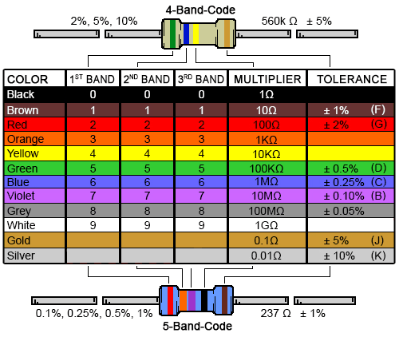

# sesion-02a
- ## Materiales

  - Protoboard
  - Parlante Imán Cerámica 8Ω 1W
  - Batería 9V
  - Potenciómetro
    - B100K
  - Chips
    - CD4017BE
    - LM386
  - Luces LED
  - Cables Dupont-Dupont
  - Resistores
    - 220 (Rojo Rojo Cafe Dorado)
    - 1K (Cafe Negro Rojo Dorado)
      
  
  
      imagen de Mecatronium Chips

- ## Pruebas protoboard
  - ### **1 LED**
    - 
  - ### **2 LED**
    - Las LED son independientes de la otra, cada una alimentandoce de manera propia
    - 
    - 
  - ### **Conexión 2 protoboard con 4 LED**
    - 
  - ### **Prueba circuito trabajo en clase**
    - 

        wowww gif

  - ## Representaciónes graficas varias de circuitos y lenguaje/abreviaciónes
    - Algunas abreviaciónes:
      - GND = Ground (Negativo/0V)
        - Por la tierra (Grounding)
      - VCC/BT = Voltaje de alimentación
        - Batería
      - R = Resistor
      - D = LED
        - Diodo

    (imagen pasar a ilustrator)
-  ## Ejercícios de circuitos y alteraciónes
  - d
- ## Kraftwerk
  - hola
- ## LCD Soundsystem
  - Sound of Silver (2007)
    - 2do album de LCD Soundsystem (de estudio)
  - Genero:
    - Dance-Punk
    - Electronica
    - Dance-Rock
  - Largo de canciones
    - Son 9 canciones y el album se extiende hasta los 56min
  - Me gusta la secuencia del synth en "Someone Great"
    - No es hostigosa y hace sentido a lo lar go de la canción
  - **"Get Innocuous!"**
    - Tiene un snare(?) arenoso que es rico auditivamente
    - Top 3 dentro del album
    - El efecto que tiene la voz de retroceso es muy llamativa
    - "You can normalize, don't it make you feel alive?" 🗣️🔥
    - El revuelto de synths y un violin(?) al final es muy choro
      - Violines al final de la primera
        - Me recuerda a Us (Tower of Love) de Slauson Malone 1
          - Probablemente se inspiró en ellos
  - **"Time to Get Away"**
    - Voz unica (no fome)
    - No le da miedo mostrar emoción y cambiar tonos que quizas suenen un poco ridiculos en el buen sentido
      - Esto dentro de todo el album, pero más prominente en esta canción
      - Me recuerda a Hot Freaks y Cameron Winter
    - Muy funky
  - **"North American Scum"**
    - El coro me suena medio AC/DC #lol?
    - No se por que pero no me llama mucho la antención esta canción
      - Es un poco nothing burger
  - **"Someone Great"**
    - Mi secuencia de synth favorito en el album
      - Está muy bien articulado si se me entiende
    - Top 3 dentro del album
  - **"All my friends"**
    - No me llamó tanto la antención(?)
      - Quizas la tengo que escuchar unas veces más
        - Lo escuché unas veces más y si cambio mi opinión
          - Me gusta mas el instrumental parece
            - Me dí cuenta de más elementos como un ruido tipo feedback pero más ruidoso(?)
              - Y la intro es tambien muy llamativa
  - **"Us V Them"**
    - Semi-funky
    - "Us v them, over and over again"
      - Catchy
  - **"Watch the Tapes"**
    - Siento que la letra encaja muy bien en el instrumental(?)
      - No se siente como piezas separadas
        - No que el resto de canciones sí, pero en esta me di cuenta más
    - Dentro de todo no mi favorita
  - **"Sound of Silver**
    - Modulación interesante en el arp
    - Se siente un poco mas new-vawe
    - Dentro de los instrumentos el piano me gusto lo más
      - Tiene un reverb creo
    - Dentro de todas, mi menos favorita
  - **"New York, I Love You but You're Bringing Me Down"**
    - Dentro de las top 50 canciones de toda la vida
      - Por esto elegi este album
      - Creo que no hay nada malo o que se sienta fuera de lugar
        - Dicho esto, la canción en si se siente fuera de lugar (hablando del album)
      - La letra es preciosa
      - Hay una ambientación atmosferica muy linda casi siempre atrás de todo
        - Se siente como algo de Grouper
      - La guitarra no es normal
      - Muy interesante como vuelve la canción al final
 
  
