# sesion-03a

- ## apuntes clase hola
  - nuevos'ish materiales!!!
    - botones
      - 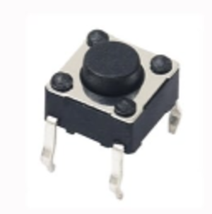
        - este boton esta diseñano para que quepa en las protoboard
        - tiene 2 lados
          - uno positivo y uno negativo
            - son 4 pins pero 2 están contectados paralelamente
            - para indentificarlos, hay unas marcas en la parte inferiór pero también tienen el mismo sacado que las LED
    - cables caiman
      - 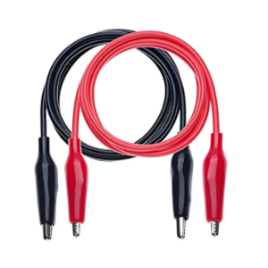
        - sirve para poder conectar el parlante a un condensador/cualquier otra cosa
        - se llaman caiman por el conector que tienen
          - te permite agarrarte de lugares, ya que tienen una especie de "perrito" metalico
    - parlante
      - 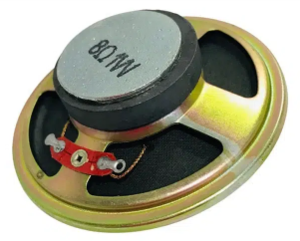
        - ya lo habia mencionado en otro README pero ahora si lo usamos asiq
        - es de 9Ω 1W
          - funciona convirtiendo señales electricas en moviemiento a traves de electromagnetismo que mueve el "cono" del parlante
            - puedo estar mintiendo pero es asi de lo que me acuerdo/tengo anotado
          - (para este tipo de parlante necesitamos los cables caiman para tener una conexión estable)
         
     - ### que es una frequencia??????????????????????????????????
       - 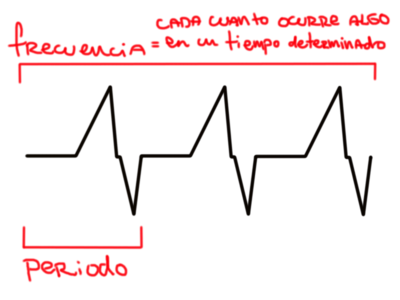
         
    - ## 1er ejercicio
      - 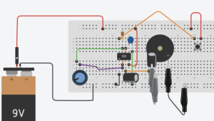
        - aquí se usa el chip 555
    - ### **en protoboard**
      - 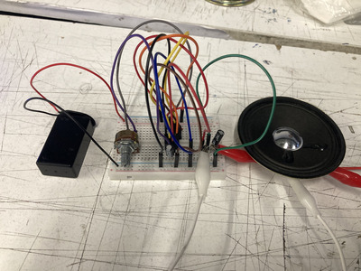
        - lo que si cambiamos (lo modifiqué con mi compañero hola nico) fueron los condensadores
          - cambiamos el de 100uf por uno de 10uf y 1uf (si no mal recuerdo)
            - mientras menor uf, más rapido/agudo suena
            

(video)

- ### **con fotoresistor**
  - decidimos añadir un fotoresistor al protoboard para ver como se controlaria el sonido
 

(video)

- ### **ahora fotoresistor y potenciometro**
  - primero experimentamos más con como/donde poner el potencometro para manejar mejor el tono con la luz

(video)

  - intentamos tocando canciones simples
    - intento de "feliz cumpleaños"

(video)

  - tengo potencial

- ### intento de conectar 2 parlantes
  - no fue docuentado pero intente conectar 2 parlantes al circuito y terminé quemando el 555 de mi compañero :(
    - 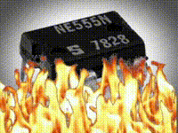
   
- ## toy organ
  - como tarea teniamos que hacer un circuito que nos mostraros los profes para hacer un sintetizador en el proto
    - 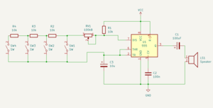
      - lo hicimos con 1 boton primero para ver si funcionaba
      - nos juntamos de a 3 para intentarlo después de clases y no nos funcionó
        - 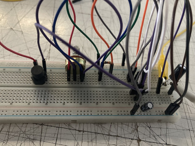
        - 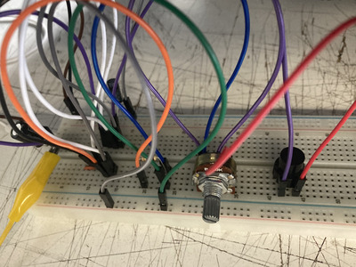
        - 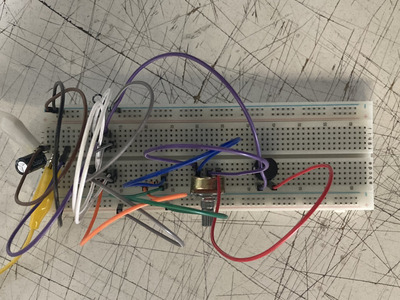
        - 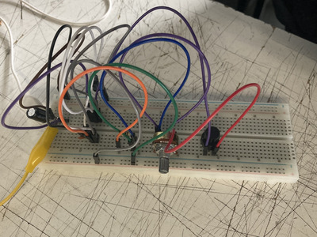
          - al probar conectando/desconectando distintos cables el 555 se empezó a calentar mucho
            - y murió
              - 
            - lo intenté denuevo otro dia para ver si lo podria hacer
              - denuevo no me funcionó
                - 
    - encontré un video en youtube que hacia una especie de toy organ
      - https://www.youtube.com/watch?v=Mw5FAIA1ghs
      - no es el que nos pidieron pero era una versión alterna
        - lo intenté hacer y no me funcionó como deberia
          - no lo segui al pie de la letra tampoco, más que nada era para hacer algo
          - 
          - pero si sonaba interesante!!!
            - 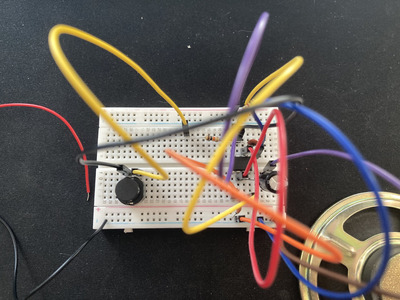 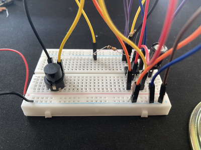 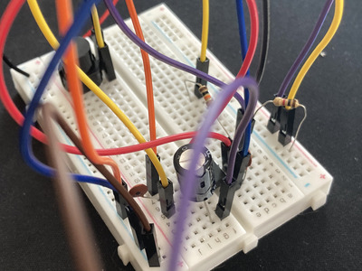
           
(video)

  - el boton estaba ahí por ninguna razón, no cambiaba nada
  - mi favorito (100uf)
    - suena fuerte y distorcionado

(video)

  - le cambié la resistencia que da al parlante por una de 10uf

(video)

  - le cambié el boton por 2 potenciometros para poder manejar mejor el tono
    - y un fotoresistor para manejarlo más rapido
   
---------------------------------------------------------------------------------------------------

- ## **variaciones espectrales**
  - documental 2013
  - carlos lertora
 
  - nuevos sonidos de oscilaciónes electricas
    - sonidos electronicos
      - sonidos puros
        - producidos por una vibración
          - sinewave ej
          - todo el rango de audición
  - musica experimental necesitaba muchos medios caros para realizarla
  - circuit bending
    - ??????
  - ISL (Interfaz sonora luminica)
  - AI-MAAKO (Festival)
  - electro-acustica
    - musica electronica sin computador
    - 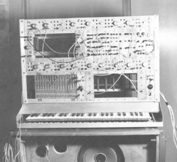
  - Jose Vicente
    - 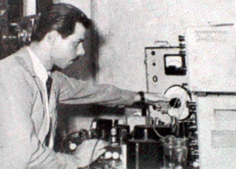
    - compositor e ingeniero/investigador
    - "musico misterioso"
      - hizo algo imoprtante pero por la epoca fue olvidado
    - variaciones espectrales (1959)
    - variaciones espectrales n3 evocativa (1959)
      - partitura(?) en papel
        - dibujado a mano con figuras geometricas que forman el sonido
      - espectro
        - espectrograma
      - crea su tipo de partitura para esta musica espectral
        - con simbolos propios
    - se va con beca a alemania para seguir trabajando
    - 71-71 llegan equipos para su laboratorio de la universidad
    - 69-70 piensa en la posibilidad de hacer musica con computadores
    - construye su computador
      - con **2kb de RAM**
      - predecesor del MIDI
    - empieza a desaparecer
  - 90's
    - profesor deja de lado el embiente academico
      - va a francia
      - empieza a escribir sobre la musica electro-acustica
        - descubre lo importante que fue Jose Vicente
          - lo buscan para trabajar con el
  - musica de pajaros :)
    - se graban sonidos en cinta
      - se corta y pega para editar
       - al colocarlo de vuelta se escuchaba muy unico
      - apropiarse concretamente del sonido como material
     
- 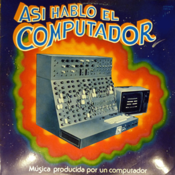
  - https://www.youtube.com/watch?v=pAIVrKc7xsQ
    - "El jazz del computador" es mi favorita
      - muy entretenida y diversa
        - me hizo feliz

-
    
