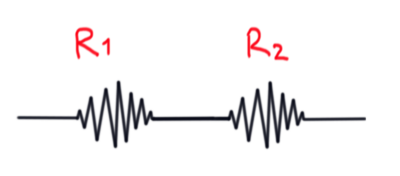
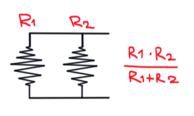
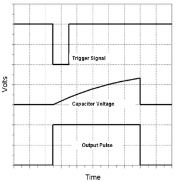
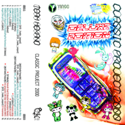

# sesion-03b

- ## apuntes hola
  - ## **Resistencias equivalentes**
    - en serie
      - 
        - en este caso se calcula la resistencia sumando cada una
          - R1 + R2
    - en paralelo
      - 
        - si ambas (o más) resistencias son del mismo valór se puede calcular como el valór dividido en 2

  - nuevo modo de 555!!!!!!!!!!!!!!!
    - monoestable
      - 
      - 
        - ahora se conecta el 6 y el 7, no el 6 y 2 wooooooowwwwwwwwww
       
  - ### **musica electronica interesante!!!!!!!11!**
    - referentes chilenos 
      - 
        - https://dismissyourself.bandcamp.com/album/000-deluxe-edition
          - musica electronica con demasiadas cosas pasando al mismo tiempo
          - nightcore, hard trance
        - (en chile tmb está segunda mordida)
          - https://segundamordida.bandcamp.com/album/mundo
    - persona X japonesa que hace musica impactante
      - 
        - https://hakushihasegawa.bandcamp.com/track/enbami
          - suele hacer una mezcla de jazz con elementos electronicos
            - pero tiene esta canción que tiene imo el mejor diseño de sonido(?) que he escuchado en una canción hace rato
          
  - ### **documental de escena electronica en chile!!!!!!**
    - https://www.youtube.com/watch?v=yIyhc8ojSi8
      - muy bueno
        - muestra distintas secciones de la electronica en chile
      - las imagenes de los rave en 1999 y 2000's lo encontré muy lindo con la gente el la plaza apropiandose del espacio publico
      - y al final muestran a LluviaAcida
        - se relacionan con lugares y trabajan con ello
          - ej: la antártica

      - 
