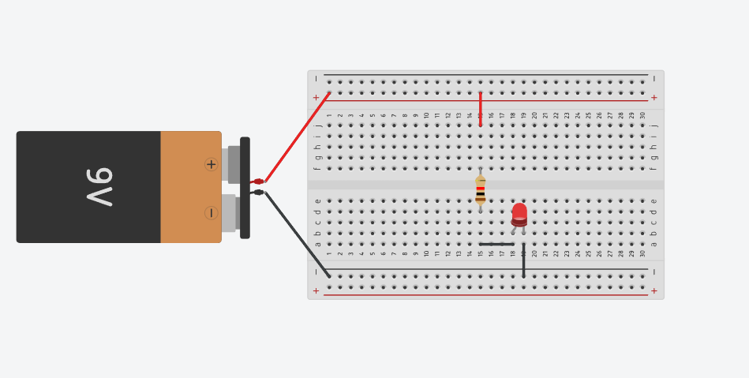
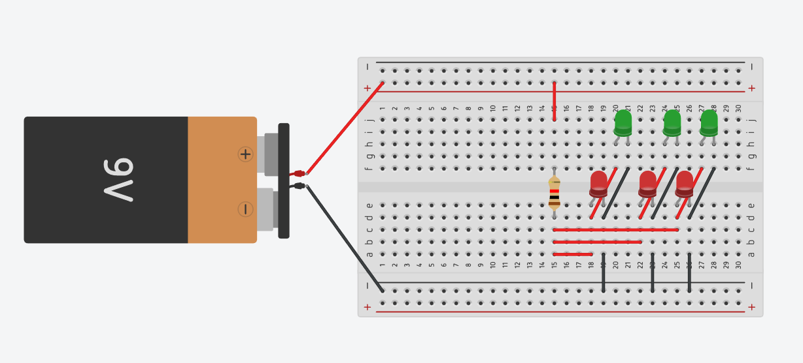

# sesion-01b

13-03-2026

## Apuntes 

- Voltaje (V) o tensión eléctrica es la diferencia de potencial que empuja a los electrones a moverse en un circuito. Se mide en voltios (V) y funciona como la presión que permite el flujo de electricidad.** Se identifica comúnmente con el cable rojo **, que indica el mayor potencial eléctrico.

- Tierra (GND) es el punto de referencia eléctrica del circuito. Representa el nivel de voltaje cero y sirve como retorno de la corriente, permitiendo que el circuito funcione de forma estable y segura. ** Se identifica con el cable negro **.

- Resistencia (R) es el componente que se opone al paso de la corriente eléctrica, controlando cuánta electricidad circula en un circuito. Se mide en ohmios (Ω) y se utiliza para proteger componentes, regular voltaje y limitar corriente.

- Flujo: movimiento de cargas eléctricas a través de un conductor.

- Potencial: nivel de energía eléctrica en un punto del circuito.

- Corriente: cantidad de carga eléctrica que fluye por un conductor; se mide en amperios (A).

- Diferencia: cambio entre dos niveles eléctricos; permite que exista movimiento de cargas.

- Poder (potencia): rapidez con la que se usa o se entrega la energía eléctrica; se mide en watts (W).

- Intensidad de corriente (I) es la cantidad de carga eléctrica que atraviesa la sección transversal de un conductor por unidad de tiempo, y se mide en amperios (A). Representa el flujo de electrones en un circuito, siendo equivalente al caudal de agua en una tubería.

- ley de Ohm:
  - I = V / R
  - CORRIENTE (A) = VOLTAJE (V) / RESISTENCIA (R)

---

### Componentes
- Cable Dupont: cable con conectores macho/hembra en ambos extremos, usado para interconectar componentes en la protoboard y transferir señales eléctricas.

- Protoboard (placa de pruebas): herramienta para armar y probar circuitos sin soldar. Tiene filas verticales de 5 orificios conectados entre sí y líneas horizontales (rojo/azul) para alimentación positiva y negativa.

- Pila: fuente de energía eléctrica que transforma energía química en eléctrica.

- Resistencia: componente pasivo que limita la corriente y divide voltaje, protegiendo otros componentes. Se mide en ohmios (Ω), no tiene polaridad y su valor se indica con bandas de colores.

- LED (Diodo Emisor de Luz): componente que emite luz al pasar corriente en un solo sentido. Tiene ánodo (+) y cátodo (−); requiere resistencia limitadora para no dañarse.

- Pulsador: interruptor momentáneo que cierra o abre el circuito solo mientras se presiona.

- Condensador: componente pasivo que almacena energía eléctrica temporalmente, usado para filtrar señales y estabilizar voltajes.

- Potenciómetro: resistencia variable de tres terminales que ajusta corriente o voltaje, funcionando como divisor de tensión.

### tinkercad

---

#### Encargo

Ver el documental the internet's own boy, sobre la vida de Aaron Swartz, y escribir un reporte con fuentes y referencias sobre lo aprendido

The Internet’s Own Boy es un documental que relata la vida de Aaron Swartz, un joven programador y activista que defendió el acceso libre a la información en Internet. Desde muy pequeño destacó por su talento, participando en proyectos clave como RSS, Creative Commons y Reddit.
El documental muestra cómo Swartz entendía la tecnología como una herramienta para el bien común y cómo su activismo lo llevó a enfrentarse al sistema legal estadounidense, especialmente tras ser acusado por descargar artículos académicos de JSTOR. La presión judicial y las posibles condenas tuvieron un fuerte impacto en su salud mental, culminando en su suicidio en 2013.
La obra deja como aprendizaje la importancia del acceso abierto al conocimiento, la responsabilidad ética en el uso de la tecnología y una crítica al uso desproporcionado de leyes contra activistas digitales.
