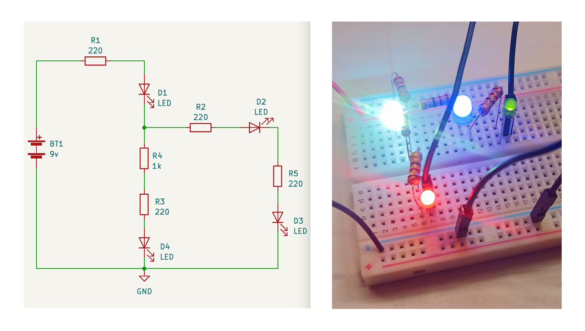
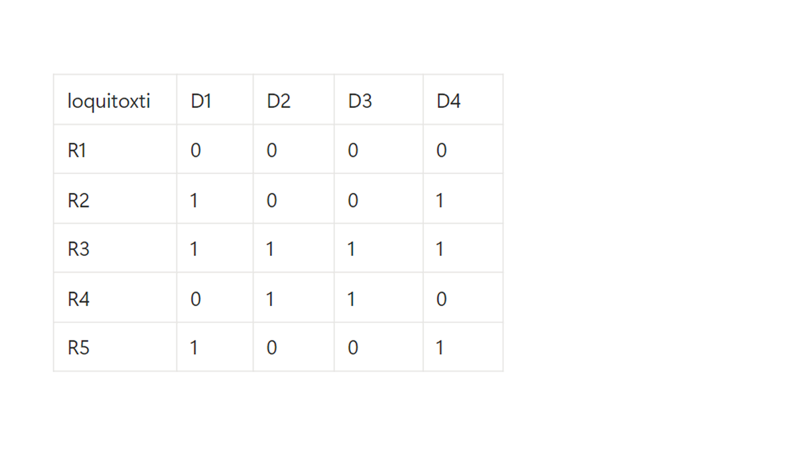

# sesion-02a

**apuntes tomados en clases:**

## circuito hecho en clases:

# ENCARGO:

# 01. Circuitos

### Circuito 1

# 02. Kraftwerk

## Álbum: Autobahn

*(Wikipedia)*

***Autobahn*** es el cuarto álbum del grupo alemán de música electrónica, en realidad el primero conocido a nivel internacional después de sus tres primeros álbumes totalmente instrumentales y experimentales. El álbum fue publicado en 1974.

*Autobahn* fue también el primer álbum conceptual de Kraftwerk. El título se traduce en castellano simplemente como "Autopista".

No es un álbum íntegramente electrónico, pues se emplearon aún instrumentos orgánicos como la flauta, el violín y la guitarra con los sintetizadores. El tema epónimo, de más de veinte minutos de duración, es el único que cuenta con letra, la cual es cantada por Ralf Hütter y Florian Schneider  con sus voces retocadas con vocoder; los cuatro restantes temas son solo instrumentales.

La mayoría de críticas señalan a Autobahn como un disco clave en el desarrollo de la música electrónica, y le dan calificaciones favorables. AllMusic lo describió como un “álbum pionero” en el cual “las raíces del electro-funk, el ambient, y el synth pop son evidentes”.

Fue incluido en el libro *1001 discos que hay que escuchar antes de morir*.

La edición tal como apareció originalmente en 1974 en disco de vinilo ocupa todo el lado A con el tema epónimo, mientras los restantes cuatro temas se encuentran en el lado B.

#### Significados:

### Contexto: 1974

*(Vista de IA)*

En 1974, la música mundial vivió una transición vibrante, destacando el nacimiento de la música disco con "Rock Your Baby" de George McCrae y el ascenso del pop sueco con ABBA ganando Eurovisión con "Waterloo". Fue un año de rock maduro (Bowie, Stones), soul elegante de Barry White y *el inicio de la electrónica con Kraftwerk.* 

En 1974, la música se encontraba en un fascinante estado de **transición y experimentación**, funcionando como un puente entre la psicodelia de los 60 y el brillo comercial que definiría el final de los 70. Fue un año donde convivieron géneros establecidos con los primeros destellos de lo que pronto sería una revolución sonora.

**1. El Salto a la Polifonía Real**

Hasta entonces, la mayoría de los sintetizadores eran monofónicos (solo podías tocar una nota a la vez). En 1974, **Tom Oberheim** lanzó el **SEM (Synthesizer Expander Module)**, que permitía combinar varios módulos para crear los primeros sintetizadores **polifónicos analógicos** comercialmente viables (el Oberheim 2-Voice y 4-Voice). Esto permitió que los tecladistas pudieran tocar acordes complejos con sonidos electrónicos por primera vez. 

**2. El Nacimiento del Audio Digital**

Aunque el CD y el MP3 estaban a décadas de distancia, 1974 fue un año clave para la síntesis digital:

- **Yamaha** construyó su **primer prototipo de sintetizador digital** basado en la síntesis por modulación de frecuencia (FM). Esta tecnología eventualmente dominaría los años 80 con el famoso DX7.
- Se lanzó el **RMI Keyboard Computer**, considerado el **primer sintetizador digital comercial**. A diferencia de los modelos anteriores que usaban voltajes, este generaba ondas mediante circuitos digitales, ofreciendo un sonido "frío" y limpio que fascinó a artistas como Jean-Michel Jarre.
    

**3. La Evolución de las Cajas de Ritmos**

Las baterías electrónicas dejaron de ser simples acompañamientos para órganos de sala:

- **Roland** presentó la **SH-3A**, y aunque era un sintetizador, introdujo conceptos de mezcla de ondas que influyeron en sus futuras cajas de ritmos.
- **Bandas como Kraftwerk revolucionaron el uso de estos aparatos en su álbum *Autobahn* (1974), utilizando unidades de ritmo modificadas y almohadillas de percusión personalizadas para crear ritmos puramente electrónicos.**
- Artistas de jazz como **Miles Davis** comenzaron a integrar cajas de ritmos en sus presentaciones en vivo, validando la tecnología en géneros más tradicionales.

**4. Equipos de Estudio e Instrumentos Portátiles**

- **Yamaha SY-1**: Fue el **primer sintetizador analógico portátil** de Yamaha lanzado en 1974. Estaba diseñado para ser fácil de usar, con sonidos preestablecidos seleccionables mediante botones, lo que acercó la síntesis a músicos que no eran ingenieros.
- **Grabación Multipista**: Se estandarizó el uso de grabadoras de **24 pistas**, permitiendo una complejidad de edición y capas de sonido que antes requerían malabarismos técnicos extremos en el estudio.

### Apuntes y opiniones:

# 03. LCD Soundsystem

## Álbum: Sound of Silver

(Vista de IA)

El segundo álbum de **LCD Soundsystem**, *Sound of Silver* (2007), **es considerado una de las obras definitivas del dance-punk y el rock alternativo de la década de los 2000**. 

**El Proceso de Grabación**

- **Aislamiento y Estética:** James Murphy decidió grabar el disco en una granja en Longueira, Massachusetts, llamada Long View Farm. Para establecer una identidad visual y sonora, **cubrió todas las paredes con papel de aluminio** (silver foil) para recrear una estética plateada y futurista.
- **Control Creativo:** Aunque la banda oficial incluía a colaboradores de **DFA Records** como Pat Mahoney, Tyler Pope y Nancy Whang, Murphy mantenía un control absoluto, a menudo regrabando partes por sí mismo para lograr la precisión exacta que buscaba.
    
    **Classic Album Sundays +2**
    

**Temáticas y Narrativa**

- **Cruce de Géneros:** El álbum es famoso por fusionar la estructura del rock con la energía de la música electrónica de Nueva York de los años 70 y 80.
- **Ansiedad y Madurez:** A diferencia de su debut, este disco explora temas más emocionales y personales como la **ansiedad, la depresión, el miedo al cambio** y la rutina.

**Instrumentos y Equipamiento Clave**

- **Sintetizadores y Teclados:**
    - **Roland Juno-60 y SH-101:** Fundamentales para las líneas de bajo de onda cuadrada y los arpegios percusivos que definen temas como "Get Innocuous!".
    - **Baldwin Fun Machine:** Un órgano doméstico de los años 70 modificado con filtros externos, protagonista en el riff principal de "Us v Them".
    - **Moog Taurus II y Korg SQ10:** Utilizados en conjunto para crear secuencias modulares profundas.
    - **EMS VCS 3 (The Putney):** Un sintetizador legendario usado para procesar sonidos y añadir texturas electrónicas crudas.
    
- **Batería y Percusión:**
    - **Gretsch Jazz de 1957:** Murphy utilizó este kit clásico para casi todas las grabaciones por su tono natural excepcional.
    - **Técnica de los Mousepads:** Para lograr un sonido de batería seco y "thuddy" (especialmente en el tema homónimo), pegaron trozos de **alfombrillas de ratón** (mousepads) sobre los parches de los tambores para amortiguar la vibración.
    
- **Cuerdas y Bajos:**
    - **Bajo Epiphone de los 60:** Un modelo sin nombre que Murphy conecta siempre a un amplificador **Ampeg Portaflex B-15** de tubos para obtener un tono cálido y sólido.

**Avances y Técnicas de Grabación**

- **Estética Espacial (Papel de Aluminio):** Más que un adorno, cubrir el estudio **Long View Farm** con papel de plata y telas metálicas buscaba influir psicológicamente en la producción para que el álbum tuviera una textura "brillante y reflectante".
- **Cadena de Audio Analógica:** Murphy priorizó el uso de preamplificadores **Universal Audio** y compresores clásicos como el **Teletronix LA-2A** y el **DBX 165** para procesar voces e instrumentos antes de entrar al dominio digital, manteniendo el calor del sonido de cinta.
- **Microfonía Vintage:** Se utilizaron micrófonos de cinta y condensador clásicos, destacando el **Neumann TLM 193** para casi todas las voces y el **Sennheiser MD 409** para capturar la energía del directo en el estudio.

### Apuntes y opiniones:

Honestamente, no analicé cada canción como con la otra banda porque me gustó mucho y preferí dedicarle toda mi atención y disfrutarlo. A diferencia del anterior, que eran sonidos con los que no estaba familiarizada y todo sonada muy nuevo y trataba de entenderlo, indagando mucho más en analizarlo, este álbum tiene un sonido mucho más familiar. Me gusta como mezcla distintos géneros y logra una especie de rock, que tiene energía, dan ganas de hasta bailarlo, disfrutarlo, y ponerle atención a los distintos tipos de sonidos que van aparecieron con la mezcla de sintetizadores e instrumentos.

Quedé muy contenta con ambos ejercicios, siento que con Kraftwerk conocí sonidos muy nuevos para mí que probablemente en otra instancia no les haya dado la oportunidad de escucharlos, mientras que con LCD Soundsystem solo me queda decir que quedé muyyy conforme y este álbum en específico no va a ser la única vez que lo escuche :)
