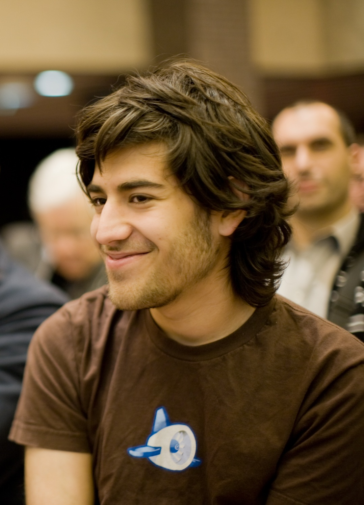
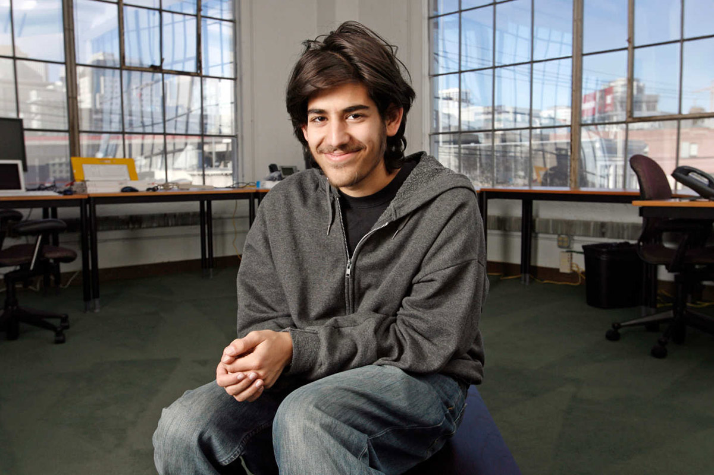

# sesion-01b 13.03

## Palabras Bonitas
+ Resistencia (R): Las resistencias son componentes pasivos que limitan el flujo de corriente y regulan el voltaje en un circuito, midiéndose en ohmios.
+ Flujo
+ Potencial
+ Corriente (I) - intencidad
+ Poder
+ Voltaje (V)
+ Energía
+ Materia:
  - Carbón
  - Silicio
  - Cobre
  - Cable: Nodo/Punto

- **Mitchel Resnick** (nacido el 12 de junio de 1956) **según Wikipedia** es un informático estadounidense. Es profesor LEGO Papert de Investigación del Aprendizaje en el Media Lab del Instituto Tecnológico de Massachusetts (MIT) y fundador de Scratch .

- **TinkerCad** Según Gemini: es una plataforma en línea gratuita, desarrollada por Autodesk, diseñada para la creación de modelado 3D, simulación de circuitos electrónicos y programación basada en bloques. Ideal para principiantes, estudiantes y educadores, permite diseñar piezas para impresión 3D y prototipar circuitos sin componentes físicos.

Caudal: Cuanta agua pasa por un lugar

**Electrón:** Un electrón es una partícula subatómica estable, con carga eléctrica negativa y una masa muy pequeña, que orbita el núcleo atómico. Son componentes esenciales de la materia, responsables de los enlaces químicos y, al moverse, generan corriente eléctrica

Corriente (I) = Voltaje (V) / Resistencia (R)

- La **resistencia** se mide en **ohm** (Ω)
- **Voltaje** se mide en **voltios**
- **Corriente** se mide en **amperios** (as)

Led: Pata larga, triangulo pequeño, ánodo (positiva) / Lado plano (negativo)

### Encargo 01b
1. seguir experimentando con github y markdown, agregar imágenes, tablas, enlaces, etc.
2. ver el documental the internet's own boy, sobre la vida de Aaron Swartz, y escribir un reporte con fuentes y referencias sobre lo aprendido.

### internet's own boy

El documental **The Internet’s Own Boy: The Story of Aaron Swartz**, dirigido por Brian Knappenberger, relata la vida de Aaron Swartz, un programador, escritor y activista que defendió el acceso libre a la información en internet. A través de testimonios de cercanos, la película muestra tanto sus logros tecnológicos como su lucha política, y las consecuencias legales que enfrentó.

Swartz estuvo involucrado en proyectos importantes como Reddit y Creative Commons, pero lo que realmente marcó su trayectoria fue su visión de que el conocimiento debía ser accesible para todos.

A partir del documental, se puede entender el concepto de acceso abierto como una postura ética frente a cómo se distribuye la información en la actualidad. Swartz cuestionaba que investigaciones científicas y documentos académicos estuvieran restringidos detrás de pagos, considerando que ese conocimiento muchas veces se produce con financiamiento público. Este conflicto se hizo evidente cuando descargó una gran cantidad de artículos desde JSTOR, lo que derivó en un proceso judicial en su contra.

Swartz actuaba desde una lógica de justicia social y acceso igualitario; por otro, el sistema legal lo trató como un criminal. Además, el documental también evidencia el rol del activismo digital. Swartz participó en movimientos contra leyes que buscaban limitar la libertad en internet, demostrando que la organización online puede tener un impacto real en decisiones políticas.

**Aaron Swartz** representa una postura crítica frente a los límites del sistema, y plantea preguntas relevantes sobre quién controla el conocimiento y bajo qué condiciones debería compartirse.

