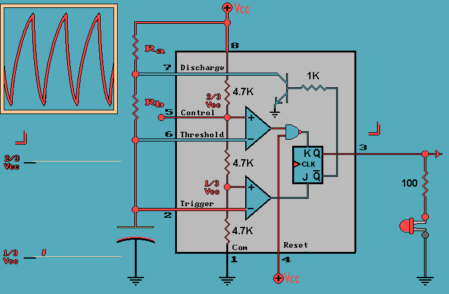
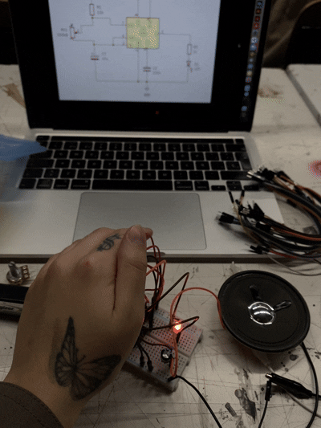
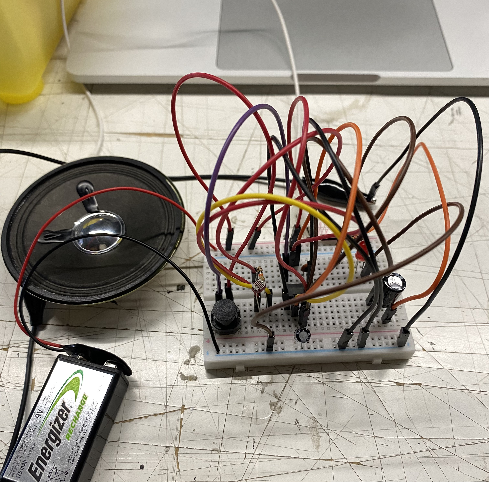

# sesion-03a 24.03

## Chip NE555

* frecuencia (t): periodo } onda
* frecuencia -> 1:periodo

Según gemini: Un **circuito astable** es un tipo de multivibrador en electrónica que no tiene estados estables, oscilando continuamente entre un estado "alto" y uno "bajo". Funciona como un oscilador autónomo que genera una onda cuadrada constante, comúnmente utilizada para temporizadores, relojes o luces intermitentes, sin necesidad de un gatillo externo. 

**Ra:** Siempre mayor de 1K

Según gemini: **Oscilar** significa realizar un movimiento o variación repetitiva de ida y vuelta alrededor de un punto central o de equilibrio. En el contexto de la frecuencia, **cada ida y vuelta completa** es una «oscilación» o «ciclo», y la frecuencia mide cuántas de estas oscilaciones ocurren por segundo (medido en Hertz o Hz). 

`La frecuencia se ve afectada por el condensador y las resistencias.`

**El condensador** es un torniquete, un suavisante, corta la parte constante de la señal, deja pasar el cambio, si no hay cambio, no pasa.

En la onda que se produce con el sonido, lo que **suena** en el parlante es **cuando cambia**, no en los límites.

### Amor

La interpretación de "amor" como "sin muerte" (A-mors) es una etimología poética popular que sugiere que el amor verdadero es eterno, incondicional y perdura más allá de la muerte física. Aunque lingüísticamente se considera falsa (mezcla prefijo griego 'a-' con latín 'mors'), simboliza la inmortalidad del sentimiento.

### Referentes:

* David Tudor: David Eugene Tudor fue un pianista y compositor estadounidense de música experimental. Estudió piano con Stefan Wolpe y al tiempo ganó fama como uno de los principales intérpretes de la música de vanguardia para piano.
* Jhon Cage: La importancia del silencio en el arte. Pionero de la música aleatoria, de la música electrónica y del uso no estándar de instrumentos musicales.

### Interruptores

* **Switch:** controlan el flujo de corriente para encender/apagar cargas.
* **Temporales:** automatizan este proceso basándose en el tiempo.

<https://www.555-timer-circuits.com/toy-organ.html>
