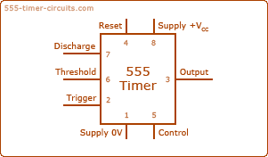
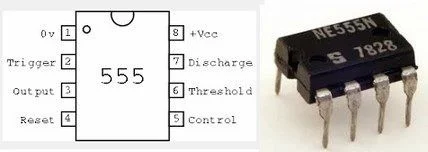
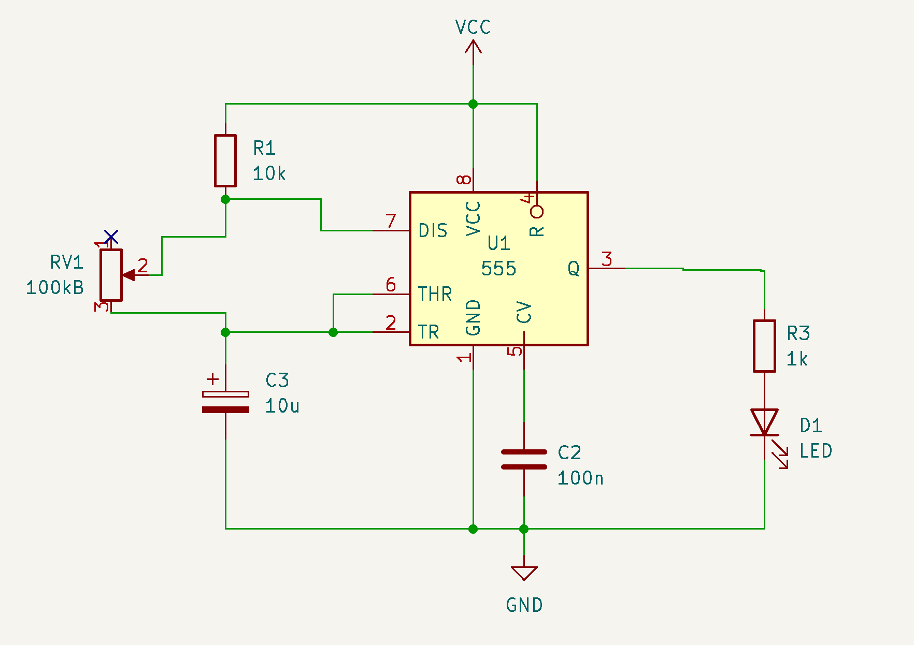
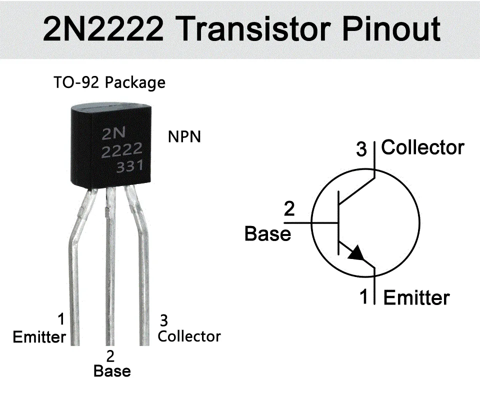

# sesion-03b

## Apuntes clase viernes 27 de marzo ##

### Simbología ###

En base a la cantidad de componentes ya vistos, procederé a realizar un resumen sobre la simbología para reforzar estos contenidos.

> No se explicarán los ya vistos en la [/sesion-02b/README.md](../sesion-02b/README.md)

[Foto simbologia bitacora fisica]

 

### Chip 555 ###

A pesar de llevar un par de sesiones trabajando este chip, vamos a hacer breve definición de este chip tan versatil

El **555** en palabras simples es un *timer*, es decir, recibe una corriente constante y la transforma a una intermitente, su frecuencia varia de como se configure con cada *pata*

Cada punto de conexión quedaría así

| Pin | Nombre | Función |
| - | - | - |
| 1 | GND | Conexión a tierra |
| 2 | Trigger | **Disparo**. Inicia el ciclo de temporización cuando el voltaje cae por debajo de $1/3$ de $V_{CC}$ |
| 3 | Output | **Salida.** Aquí es donde se conecta la carga (LED, parlante, etc.). Da voltaje alto o bajo |
| 4 | Reset | **Reinicia** el chip si se conecta a tierra. Normalmente se conecta al positivo para que no se reinicie solo |
| 5 | Control | Permite variar el umbral de comparación mediante voltajes externos. Se suele usar un pequeño capacitor aquí para evitar ruido |
| 6 | Threshold | **Umbral**. Detiene el ciclo de temporización cuando el voltaje supera los $2/3$ de $V_{CC}$ |
| 7 | Discharge | **Descarga**. Se usa para descargar el capacitor externo que determina el tiempo del ciclo |
| 8 | VCC | **Alimentación**. El polo positivo (normalmente entre 4.5V y 16V) |

 

> Imagen de chip 555, sumado a lectura de sus Pin

 

 

#### Modo Astable ####

Fue el primer acercamiento visto en clases, donde el modo astable convierte al 555 en un oscilador autónomo. En esta configuración el chip no tiene un estado estable (de ahí su nombre) en su lugar, la salida (Pin 3) conmuta constantemente entre alto y bajo sin necesidad de un disparo externo.

Funciona mediante la carga y descarga cíclica de un capacitor externo a través de resistencias. Se utiliza principalmente para generar ondas cuadradas, señales de reloj, luces intermitentes o ***tonos de audio.*** 

> Esquematico Astable sesion-02b

 

#### Modo Monostable ####

El modo monoestable funciona como un temporizador de ***un solo disparo***. A diferencia del astable este circuito tiene un solo estado estable

Cuando recibe un pulso negativo en el pin 2, la salida pasa a estado alto durante un tiempo determinado y luego regresa automáticamente a su estado de reposo.

#### Atari Punk Console ####

La Atari Punk Console (APC) es un sintetizador de audio DIY (***Do it yourself*** [Larga vida al DIY]) muy popular. Tiene como base 2 chips 555, su nombre viene de los sonidos similares a las consolas Atari.

Usa un modo astable para crear pulsos y uno monoestable para controlar su duración. Con dos perillas controlas el tono y el ritmo, creando ruidos electrónicos, chirridos y efectos *lo-fi* como dirían los lolos

***COLOCAR IMAGEN Y ESQUEMATICO DEL ATARI PUNK, HABLAR SOBRE https://www.555-timer-circuits.com/ , LUGARES DE ELECTRONICA, CHIPS QUEMADOS Y SUS REFLEXIONES, BIBLIOGRAFÍA Y SUBIR LA SIMBOLOIGIA*** 

---

## Info Adicional / Transistor 2N2222 A331 ##

En la clase se nos entrego un transistor, a pesar de que aún no lo utilizamos, realice una breve introducción sobre su funcionamiento, estos son puntos claves

> El Transistor entregado fue el 2N2222 A331

-  El modelo corresponde a la parte 2N222, la parte A331 es un código de registro del fabricante.
-  Es un transistor del tipo NPN, es decir que posee 2 modos. El primero es de tipo interruptor, sirviendo como switch normal. El segundo es un modo ***amplificador*** el cual convierte una señal debil en una más fuerte

 

 

### Partes del transistor ###

1. Emitter (Emisor): Es el contacto a tierra
2. Base: Se encarga de controlar la corriente eléctrica
3. Collector (Colector): Asociado al ingreso de la energía

-  
