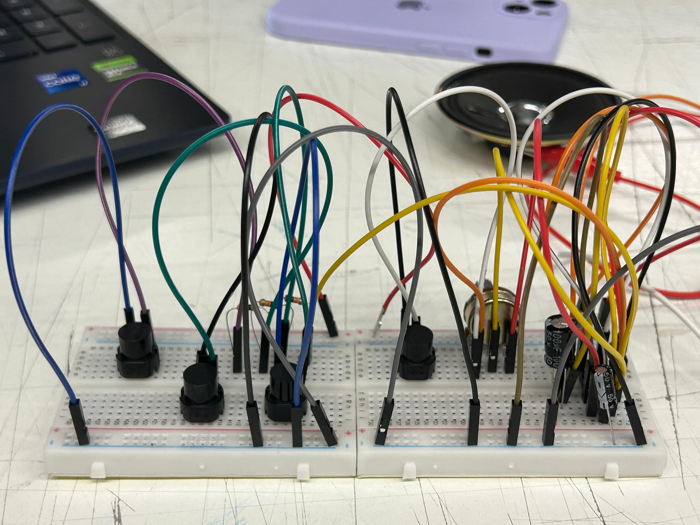
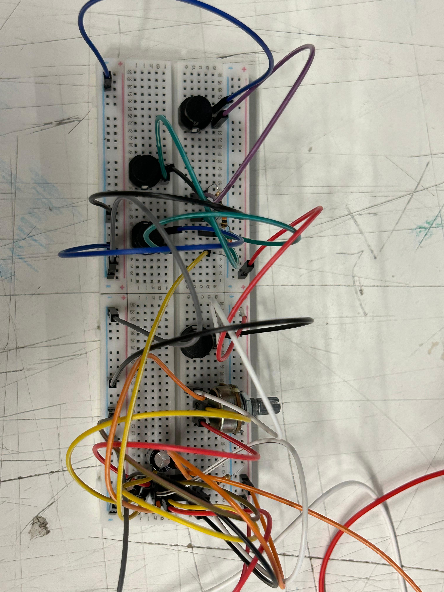
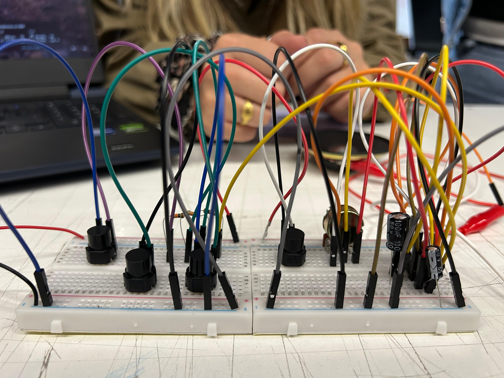
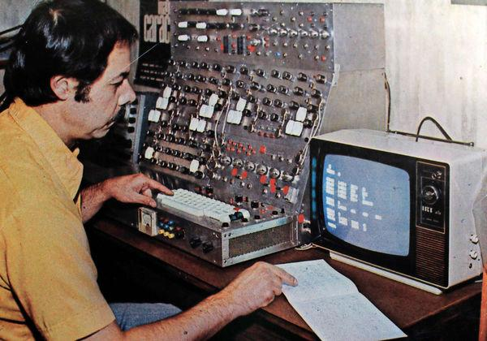

# sesion-03a
---
## Encargo 1
### Oscilador de Tonos
​Trabajamos en equipo para armar un circuito con el chip 555, logrando que funcionara a la primera incluso después de agregarle cuatro interruptores extra. Algo curioso que notamos fue que el primer botón funcionaba "al revés": el parlante no paraba de sonar y solo se callaba cuando lo manteníamos presionado. Esto pasa porque, por cómo está conectado en el dibujo, el interruptor corta o deja pasar la corriente que hace vibrar el parlante; mientras no lo tocas, el circuito sigue completando su ciclo y por eso el sonido es constante.

​Al jugar con los otros botones, nos dimos cuenta de que podíamos cambiar las notas musicales que salían del parlante. Cada interruptor que agregamos cambia la facilidad con la que la electricidad fluye por el circuito, lo que hace que el sonido sea más grave o más agudo. Lo más divertido fue que, al apretar varios botones al mismo tiempo, los sonidos se mezclaban y se volvían mucho más agudos. Esto sucede porque la energía viaja más rápido y hace que el parlante vibre con más velocidad, permitiéndonos crear diferentes melodías según la combinación de botones que usemos.

**Aqui algunas imagenes del trabajo**

## Encargo 2
### José Vicente Asuar
​José Vicente Asuar fue una figura única que combinó dos mundos: la ingeniería civil y la composición musical. Esta mezcla fue la que le permitió no solo imaginar sonidos nuevos, sino construir las herramientas para crearlos. En una época donde la música se hacía solo con instrumentos tradicionales (cuerdas, vientos), Asuar entendió que la electricidad podía ser un nuevo lenguaje artístico.

### Obras claves
+ ​Variaciones Espectrales (1958): Es su obra más famosa y un hito para toda Latinoamérica. Fue la primera pieza creada puramente con sonidos sintéticos (generados por máquinas) sin usar instrumentos reales ni micrófonos.
+ El Comdasuar: A finales de los 70, diseñó y fabricó su propio computador dedicado exclusivamente a la música. Lo asombroso es que este aparato ya anticipaba tecnologías que hoy son estándar, como la capacidad de que una computadora central le dé órdenes a otros sintetizadores.
  

Para entender el trabajo de Asuar, el usaba componentes electrónicos básicos: en lugar de una cuerda que vibra, él utilizaba osciladores y chips para generar ondas eléctricas que se transforman en audio al pasar por un altoparlante, mientras que los potenciómetros eran fundamentales en sus paneles para manipular el volumen o el tono en tiempo real.

El documental menciona cómo hoy en día muchos artistas usan el "reciclaje" de componentes electrónicos antiguos para crear música experimental, una filosofía de "hágalo usted mismo" que Asuar practicaba por necesidad y visión.

El documental tiene un aire súper melancólico y humano. Muestra cómo, entre el contexto político de la época y la llegada de los sintetizadores digitales japoneses que inundaron el mercado, el trabajo de Asuar se fue quedando en la sombra.
​Su gran invento, el Comdasuar, terminó arrumbado en una casa de campo como un "tesoro olvidado" hasta que un grupo de investigadores y músicos jóvenes lo rescató del polvo. Este reencuentro es clave porque nos recuerda que la innovación no solo pasa en los países gigantes; aquí en Chile hubo mentes brillantes que, con un cautín en la mano, vieron en las máquinas una verdadera "palanca para la imaginación".

​El video concluye con una reflexión sobre la importancia de rescatar la memoria histórica de la vanguardia chilena, recordando que los avances actuales en música digital tienen sus raíces en el coraje y la experimentación de estos pioneros.

