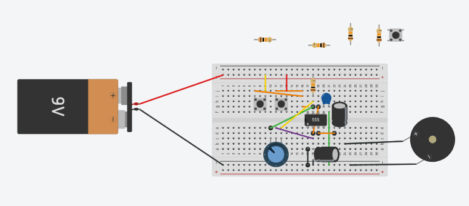
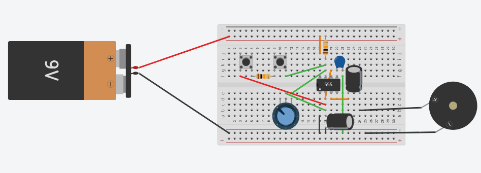
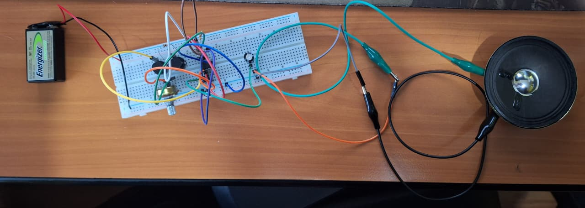
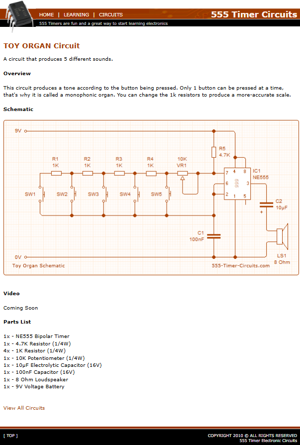

# sesion-03a

**24-03-2026**

## Apuntes de clase

Artista chileno @Sokio en Instagram

StrangeTrigger: se pueden setear sonidos para cada vez que suba o baje una acción

Video de ejemplo de vimeo Tutupá maquina hecha para percutir aunque fuera muy rustica pero con objetos a mano, se programaba a mano

y el StrangeTrigger es una interfaz para el computador que contiene: resistores, capacitores, ceramica y un 555 pero más potente

Gordon matta Clark referente

@club sonoro deportivo Instagram

555 de la semana pasada permitia la oscilacion de un led  y dividimos el circuito en 3 partes: IZQUIERDO INPUT, centro (chip) Caja negra y DERECHA OUTPUT, Sellama **Circuito Astable = (no es) Estable** "que es el amor, es Sin Muerte"

FOTORESISTOR se le dice también "LDR"

### Aprendiendo más sobre circuito Astable

Condensador mas alto en uF mas lento y mas bajo mas rápido la oscilación de las luces

el tiempo que hay entre que se repite un ciclo es una honda (t) periodo de Onda, (S) frecuencia = 1/T  Formula de frecuencia F= 1/T = 1.44/(RA + 2 RB) * C

RA tiene que ser mayor a 1k

La oscilación ocirre en la patita del chip (oscilacion estar entre prendido y apagado osea estar en 2 estados como se puede llamar: 1 o 0, on y off, True o false, etc..)

osea que el 555 está respirando segun la energia que uno le da y sellama 555 porque tiene dentro 3 resistencias casi de 5 kilos, Buscar How a 555 Timer clip work GIF

### Vamos a jugar con el Output

llegar al punto con luz y sin luz

Siempre al hacer cambios desconectar la batería

Por lo general para el parlante se coloca un condensador de 100 uF

Impotan los colores de los cables y el espacio con la distribución

Hacemos que este chip genera energia electrica que golpea los imanes de la bocina y la convierte en energía mecánica

### experimento del profe

**conecta directamente la batería el polo positivo al parlante y el polo negativo también al negativo (el parlante se enguata) pero cuando se invierten los polos el parlante se contrae)**

Jhon Cage: es bueno en música y sonido y sabe sobre champiñones

Merce Cunninhaam  

David tudor: pieza "4´33" 

COndensador en serie suavisa la señal y crea un mabió, poque es un poco mas selectivo

El inductor hace lo contrario del capacitor pero no veremos nada de algún inductor

con resistencias y condensadores puedo filtrar

Filtro escalera Moog

Oscilador victoriano, el señor se llama; Macumbista

Lo que nosotros escuchamos es el cambio de sonido

OVCC significava VOLTAGE DE CORRIENTE DIRECTA o Voltaje positivo y GND Tierra o Negativo

### interruptor 

Interruptur hay switch y temporal

              Ampolleta   Timbre
              
Son botones en este caso usaremos Temporales que son tipo timbre / Push / Momentaneo

simbolo es como una puera abierta

el interruptor del esquema solo tiene 2 patas pero para colocarlo se usan 4 para mejor estabilidad y por eso tiene 4 patas Y siempre me conecto con las diagonales que me aseguro así que siempre voy a tomar las 2 patas distintas

dejamos en la protoboard el más hacia Abajo dejamos el lado plano y dejamos arriba espacio para conectar

### SW es Switch

El circuito de la nueva tarea hace que pueda emitir sonidos a distintas frecuencias

RV es el potenciometro

### Desarrollo Encargo

Circuito Toy organ
---

Trabajé junto a mi compañero Tomás Catrileo para tener un total de 2 botones y como el se quedó con el hardware (osea mi botón / Switch), hicimos las ruebas en en TINKERCAD para entenderlo y luego desarrollarlo en físico.

Acá pongo imagenes de como tiramos el boceto y luego siguiendo el esquema dado por los profesores llegamos al resultado final

Matuvimos y repasamos el circuito aprendido en clase e hicimos el inteto siguiendo el nueco esqueme da agregarle los 2 switches mas las resistencias

Documental: Variaciones Espectrales
---

**Apuntes**

Del video de Youtube "archivo histórico y fonográfico, radio valentín leteiler, valparaíso, chile", "exposición de sonidos electrónicos y música con computadores" / Ip "el computador virtuoso".

Antes los sonidos se hacían por medio de instrumentos musicales y ahora en nuetro siglo se incorporaron nuevos sonidos de oscilaciones eléctricas a través de un alto parlante.

Existen varias categorias de sonidos electrónicos y una de ellas son **Los sonidos puros:** producidos por una sola vibración, cubren todo el tono de audición de los más graves a más agudos.

Existe est practica desde hace decadas en chile y se está re descubriendo como dice este documental subido en el 2017.

Música que es una nueva manera de componer "electro acustica".

En su epoca se estaba llamando música concreta, esto haciendolo de una manera casi utopica y más complejo que en la actualidad ya que se ha abaratado la tecnología.

Jose Vicente Asuar Músico y compositor.

Contexto determinado de arte de vanguardia, permite entregar "Estados" emocionales, intelectuales.

Se puede apreciar una "partitura" porque no tiene que asemeja los sonidos creados electro acusticos y están más que para recrear, es para analizar.

Hace una referencia a lo espectral en sus sonidos, aunque no propiamente es por esto.

Era mucho más facil parametrizar los sonidos digitales.

Esta música no es reconocida a gran escala en el mismo Chile donde hubieron pioneros desde hace tiempo pero todavia queda un gran camino por explorar tomando a grandes referentes que han dejado un gran legado y experimentación en esta área.
